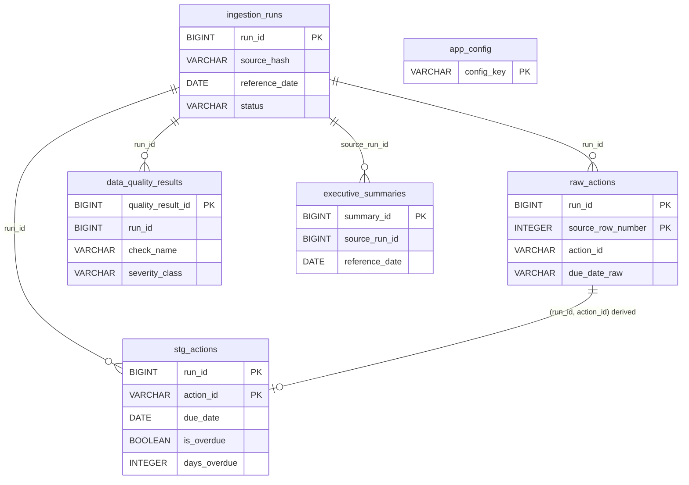

# Data Model Spec (Semantic Layer)

```yaml
doc_id: data_model_spec
filename: DATA_MODEL_SPEC.md
version: 1.0.0
status: draft
depends_on: [metric_spec]
generated_from: ddd-data-analytics v2.8.0
project: Cybersecurity Project Action Dashboard
```

เอกสารนี้นิยามโครงสร้างข้อมูลใน DuckDB (`data/cybersecurity.duckdb`) ตาม plan.md §9 ชื่อ column ยึดตาม BUSINESS_GLOSSARY.md; grain ต้องตรงกับ Grain and Filter Matrix ใน METRIC_SPEC.md

> **สถานะการ implement/ยืนยัน (2026-10-02):** DDL implement แล้วที่ `sql/00_schema/create_tables.sql` (รัน `CREATE ... IF NOT EXISTS` ที่ ST-01; มี sequence `seq_run_id`, `seq_quality_result_id`, `seq_summary_id`; FK เป็น logical ตรวจด้วย test/RI ไม่ใช่ DDL constraint) ชนิดข้อมูลในตารางด้านล่างที่ระบุ `(intended)` ตรงกับ DDL จริงแล้วในระดับที่ test โครงสร้างตรวจ (`test_ingest.py`: T-S01..S10) ตารางถูกสร้างและใช้จริงกับ sample 14,013 แถว **ยังไม่ยืนยัน:** timezone convention ของ `TIMESTAMP` (เก็บ UTC naive จากนาฬิการะบบ เฉพาะ audit) และ PDPA classification (ยัง provisional)
> **`app_config` — เขียนแต่ไม่เคยอ่าน:** ingest เขียน `reference_date` ของ run ที่สำเร็จล่าสุดลง `app_config` แต่ไม่มีโค้ดใดอ่านตารางนี้ (metrics/dashboard อ่านจาก `ingestion_runs.reference_date`) ถือเป็นข้อมูลเชิงข้อมูล (informational) เท่านั้น

## Enum ที่เอกสารนี้เป็นเจ้าของ

ค่า enum นิยามที่นี่เท่านั้น; BUSINESS_GLOSSARY.md มีเฉพาะดัชนีชื่อ

### action_status (owner: DATA_MODEL_SPEC.md)

ค่าสถานะของ action ตามที่ **source ให้มา** (`stg_actions.status`, `raw_actions.status`) ห้ามเพิ่มค่าโดยการเดา — ค่าใหม่ที่พบต้องผ่าน DQ-09 (ดู DATA_QUALITY.md) แล้วจึงมาเพิ่มที่นี่

| value | ความหมาย | ใช้ใน flag |
|---|---|---|
| `done` | งานเสร็จแล้ว | `is_completed = true`, `is_open = false` |
| `in_progress` | กำลังดำเนินการ | `is_open = true` |
| `todo` | ยังไม่เริ่ม | `is_open = true` |

หมายเหตุ: ทั้งสามค่าสังเกตจาก sample CSV (done 8,597 / in_progress 3,326 / todo 2,090) ไม่ใช่ enum ที่ producer รับรอง (ดู DATA_CONTRACT.md) Metric ใช้เฉพาะ `status = 'done'` เป็นตัวแบ่ง (METRIC_SPEC) ค่าที่ไม่รู้จักจะถูกนับเป็น open (`status != 'done'`) ตามนิยามของ plan — จึงต้องมี DQ-09 เพื่อไม่ให้เกิดเงียบ ๆ

### ingestion_run_status (owner: DATA_MODEL_SPEC.md) (implement เป็น CHECK constraint: `running`/`succeeded`/`failed`)

plan.md §9.1 ระบุ column `status` แต่ไม่ระบุค่า; ค่าต่อไปนี้เสนอจากแนวคิด "latest successful run drives dashboard" (plan.md §17)

| value | ความหมาย |
|---|---|
| `running` | run เริ่มแล้ว ยังไม่จบ (`completed_at` เป็น NULL) — ห้ามเป็น latest successful run |
| `succeeded` | validation ไม่มี finding ระดับ `blocking` และโหลด raw -> stg ครบ reconcile ผ่าน; มีสิทธิ์เป็น latest successful run |
| `failed` | validation พบ finding `blocking` (ไฟล์ถูกปฏิเสธ) หรือ pipeline ล้มเหลว; ไม่มีแถวใน `stg_actions` ของ run นี้; สาเหตุอยู่ใน `data_quality_results` |

### scd_type (owner: DATA_MODEL_SPEC.md)

| value | ความหมาย |
|---|---|
| `none` | ไม่มี history ของ attribute ภายในตาราง (หรือไม่ใช่ dimension) |
| `type_1` | เขียนทับค่าเดิม |
| `type_2` | เก็บ history ด้วยแถวใหม่ + ช่วงวันที่มีผล |

โปรเจกต์นี้ใช้ `none` ทั้งหมด (ดู Dimension Tables)

### pdpa_classification (owner: DATA_MODEL_SPEC.md)

| value | ความหมาย |
|---|---|
| `public` | เผยแพร่ได้ ไม่เกี่ยวกับข้อมูลส่วนบุคคล |
| `internal` | ใช้ภายในองค์กร ไม่ใช่ข้อมูลส่วนบุคคลตามที่ทราบ |
| `confidential` | เป็นหรืออาจเป็นข้อมูลส่วนบุคคล (รวม pseudonymous identifier ที่ยังไม่ทราบว่า re-identify ได้หรือไม่) |
| `restricted` | ข้อมูลอ่อนไหว (sensitive personal data ตาม PDPA) |

ค่าเหล่านี้เป็น label การจัดประเภทภายใน — **การตัดสินทางกฎหมายว่าข้อมูลใดเป็น personal data = `{{DPO_OR_LEGAL}}`** (CON-18)

## Fact Tables

แหล่งข้อมูลต้นทางทุกตาราง: *Weekly Action Item CSV* (`src/tee_cybersecurity_actions_mock.csv`) ผ่าน `src/ingest.py` (PIPELINE_SPEC.md) ยกเว้นที่ระบุ

ตารางที่เป็น **fact table เชิงวิเคราะห์** มีเพียง `stg_actions` (metric ทุกตัวคำนวณจากที่นี่); ตารางอื่นเป็น raw layer และตาราง control/audit — ระบุ grain ครบทุกตัวเพื่อไม่ให้มี grain ที่ไม่ประกาศ

| Table | ประเภท | Grain (1 แถว =) | Primary key | Business key / FK | Source system |
|---|---|---|---|---|---|
| `stg_actions` | fact (analytic) | 1 action ต่อ 1 ingestion run | (`run_id`, `action_id`) | `action_id`; `run_id` -> `ingestion_runs` | Weekly Action Item CSV (ผ่าน `raw_actions`) |
| `raw_actions` | raw layer | 1 แถวข้อมูลของไฟล์ต้นทางต่อ 1 run | (`run_id`, `source_row_number`) | `action_id` (อาจซ้ำใน raw; ตรวจที่ DQ-03); `run_id` -> `ingestion_runs` | Weekly Action Item CSV |
| `ingestion_runs` | control | 1 การโหลด CSV หนึ่งครั้ง | `run_id` | `source_hash`, `reference_date` (ใช้ตรวจ idempotency) | ระบบ ingest (`src/ingest.py`) |
| `data_quality_results` | audit | 1 finding ต่อ 1 check ต่อ 1 record_key ต่อ 1 run | `quality_result_id` | `run_id` -> `ingestion_runs`; `check_name` = DQ-xx | ระบบ ingest (`src/validation.py`, `sql/30_quality/`) |
| `executive_summaries` (bonus) | audit / output | 1 summary draft ที่บันทึก | `summary_id` | `source_run_id` -> `ingestion_runs` | AI summary service (`src/ai/`) |
| `app_config` | config | 1 config key | `config_key` (เขียนแต่ไม่อ่าน) | - | ระบบ ingest / deployment |

### stg_actions (plan.md §9.3)

| Column | Type | Null | คำอธิบาย | PDPA (provisional) |
|---|---|---|---|---|
| `run_id` | BIGINT | no | FK -> `ingestion_runs.run_id` | internal |
| `action_id` | VARCHAR | no | business key; unique ภายใน run | internal |
| `project_name` | VARCHAR | no | `Pxx - ชื่อ` ตาม source | internal |
| `action_name` | VARCHAR | no | ข้อความไทยอิสระ + branch tag | confidential `[pending review]` |
| `owner` | VARCHAR | no | pseudonymous `Owner-NNN` | confidential `[pending review]` |
| `due_date` | DATE | no | แปลงจาก `due_date_raw`; ไม่มีเวลา/timezone | internal |
| `status` | VARCHAR | no | ค่าตาม enum `action_status` | internal |
| `is_completed` | BOOLEAN | no | `status = 'done'` | internal |
| `is_open` | BOOLEAN | no | `status != 'done'` | internal |
| `is_overdue` | BOOLEAN | no | `status != 'done' AND due_date < reference_date` (วันเท่ากัน = false) | internal |
| `days_overdue` | INTEGER | no | `date_diff('day', due_date, reference_date)` เมื่อ `is_overdue`; ไม่เช่นนั้น `0` (placeholder ไม่ใช่ค่า metric) | internal |
| `loaded_at` | TIMESTAMP | no | เวลาโหลดโดยระบบ ingest (ไม่ใช่เวลาจาก source) | internal |

`stg_actions` **ไม่มี column `reference_date`** ตาม plan §9.3 — ค่าอ้างอิงอยู่ที่ `ingestion_runs.reference_date` ของ `run_id` เดียวกัน (ที่ใช้คำนวณ flag ขณะสร้าง stg)

### raw_actions (plan.md §9.2)

| Column | Type | Null | คำอธิบาย |
|---|---|---|---|
| `run_id` | BIGINT | no | FK -> `ingestion_runs` |
| `action_id` | VARCHAR | yes | เก็บตามต้นทาง (ว่างได้เพื่อให้ DQ-02 พิสูจน์ได้) |
| `project_name` | VARCHAR | yes | ตามต้นทาง |
| `action_name` | VARCHAR | yes | ตามต้นทาง |
| `owner` | VARCHAR | yes | ตามต้นทาง |
| `due_date_raw` | VARCHAR | yes | ข้อความดิบก่อน parse |
| `status` | VARCHAR | yes | ตามต้นทาง |
| `source_row_number` | INTEGER | no | ลำดับแถวข้อมูล 1-based ไม่นับ header (implement ตามนี้) |
| `loaded_at` | TIMESTAMP | no | เวลาโหลดโดยระบบ |

Raw layer เก็บ source semantics ให้มากที่สุด (ไม่ trim/แปลงค่า) PDPA classification ของ column ใน raw = เช่นเดียวกับ column ที่ตรงกันใน `stg_actions`

### ingestion_runs (plan.md §9.1)

| Column | Type | Null | คำอธิบาย |
|---|---|---|---|
| `run_id` | BIGINT | no | PK; มาจาก sequence `seq_run_id` |
| `source_file` | VARCHAR | no | **basename** ของไฟล์ที่ส่งให้ `--input` (ไม่เก็บ path เต็ม) |
| `source_hash` | VARCHAR | no | hash เนื้อไฟล์ (อัลกอริทึมกำหนดที่ PIPELINE_SPEC) |
| `reference_date` | DATE | no | จาก `--reference-date`; `REFERENCE_DATE` = `2026-10-02` (ค่าคงที่ iteration 1 ที่ผู้ใช้ยืนยัน; เปลี่ยนได้ผ่าน ANALYTICS_CHANGELOG เท่านั้น) |
| `started_at` | TIMESTAMP | no | เวลาระบบ ingest (ไม่ใช้ใน metric logic) |
| `completed_at` | TIMESTAMP | yes | NULL ขณะ `running` |
| `source_row_count` | INTEGER | yes | จำนวนแถวข้อมูลในไฟล์ (ไม่นับ header) |
| `valid_row_count` | INTEGER | yes | แถวที่ผ่านทุก check ระดับ `blocking` |
| `invalid_row_count` | INTEGER | yes | แถวที่ fail อย่างน้อยหนึ่ง check `blocking` (นับแถวละครั้ง) |
| `status` | VARCHAR | no | ค่าตาม enum `ingestion_run_status` |

Invariant: `source_row_count = valid_row_count + invalid_row_count` (ตรวจโดย DQ-10) Timezone convention ของ `TIMESTAMP` = `null` (owner: `{{DATA_STEWARD}}`)

### data_quality_results (plan.md §9.4)

| Column | Type | Null | คำอธิบาย |
|---|---|---|---|
| `quality_result_id` | BIGINT | no | PK (sequence `seq_quality_result_id`) |
| `run_id` | BIGINT | no | FK -> `ingestion_runs` |
| `check_name` | VARCHAR | no | ใช้ ID `DQ-01`..`DQ-12` (นิยามที่ DATA_QUALITY.md; test T-S07 ตรวจชุดที่อนุญาต) |
| `record_key` | VARCHAR | yes | ระบุ record ที่ผิด (เช่น `action_id` หรือ `source_row_number`); NULL = finding ระดับไฟล์ |
| `severity_class` | VARCHAR | no | ค่าตาม enum `rule_severity` (owner: DATA_QUALITY.md) |
| `message` | VARCHAR | no | ข้อความอธิบาย — ห้ามใส่ค่า `owner`/`action_name` เกินความจำเป็น |
| `created_at` | TIMESTAMP | no | เวลาระบบ |

### executive_summaries (plan.md §9.5 — bonus)

ใช้ชื่อ field ตาม **plan.md §9.5** เป็นมาตรฐานเดียว (ไม่ใช้ชื่ออื่นที่ปรากฏใน plan §5 AI-03 เช่น `generated_at`, `source_snapshot_id`, `model_provider`)

| Column | Type | Null | คำอธิบาย |
|---|---|---|---|
| `summary_id` | BIGINT | no | PK; ค่าจาก sequence `seq_summary_id` (`nextval` ตอน insert) |
| `created_at` | TIMESTAMP | no | เวลาสร้าง (แสดงเป็น generated timestamp บน UI) |
| `reference_date` | DATE | no | reference date ของ run ต้นทาง |
| `project_filter` | VARCHAR | yes | NULL = All Projects (implement ตามนี้); ไม่เช่นนั้นเป็น `project_name` |
| `source_run_id` | BIGINT | no | FK -> `ingestion_runs.run_id` (provenance) |
| `summary_text` | VARCHAR | no | ข้อความ draft (label เป็น draft) |
| `provider` | VARCHAR | no | ค่าคงที่ `'openrouter'` (ไม่ใช่ credential; ไม่มาจาก env) |
| `model_name` | VARCHAR | no | ค่าคงที่ `'anthropic/claude-sonnet-5'` (model slug ใน code/config; ไม่มาจาก env) |
| `prompt_version` | VARCHAR | no | เวอร์ชัน prompt (ปัจจุบัน `exec-summary-v2`) |

ห้ามมี column เก็บ `OPENAI_API_KEY` / `OPENAI_BASE_URL` (CON-21) Provider/model ตามการตัดสินใจของผู้ใช้ (CON-27); ถ้า provider/model เปลี่ยนในอนาคต ค่าใน column นี้เปลี่ยนตามและต้องบันทึกผ่าน ANALYTICS_CHANGELOG

### app_config (implement แล้ว — เขียนอย่างเดียว ไม่มีผู้อ่าน)

plan.md §7 ระบุเพียงว่ามี `app_config` เก็บ `reference_date` โดยไม่นิยาม schema (plan §9 ไม่มีหัวข้อของตารางนี้) schema ที่ implement (ตรง DDL):

| Column | Type | Null | คำอธิบาย |
|---|---|---|---|
| `config_key` | VARCHAR | no | PK เช่น `reference_date` |
| `config_value` | VARCHAR | no | ค่าเป็นข้อความ |
| `updated_at` | TIMESTAMP | no | เวลาระบบ |

**กฎ:** ค่าที่ใช้คำนวณ metric ของ run ใดต้องอ่านจาก `ingestion_runs.reference_date` ของ run นั้น `app_config.reference_date` เขียนโดย ingest (INSERT OR REPLACE) แต่ **ไม่ถูกอ่านโดยโค้ดใด** และไม่ใช่ default ของ `--reference-date` (CLI บังคับให้ส่งทุกครั้ง) — ตอบ Q3: ใช้ `ingestion_runs.reference_date` เป็นแหล่งเดียวใน practice ห้ามเก็บ secret ใน `app_config`

## Dimension Tables

**ไม่มี dimension table ที่เป็น physical table** ใน design นี้ (plan.md §9 ไม่กำหนด) Dimension ที่ใช้ซอย metric — `project_name`, `owner`, `status`, `due_date` — เป็น **degenerate dimension** อยู่เป็น column ใน `stg_actions` เนื่องจาก source ไม่มีตารางอ้างอิง/attribute เพิ่มเติม (เช่น ไม่มีรายชื่อโครงการ, ไม่มี mapping `owner` กับทีม)

| Dimension | อยู่ที่ | Primary key | `scd_type` | Key attributes |
|---|---|---|---|---|
| project | `stg_actions.project_name` (degenerate) | n/a — ค่า distinct ต่อ run (12 ใน sample) | `none` | รูปแบบ `Pxx - ชื่อ`; ตัวเลือกใน project filter = `DISTINCT project_name` ของ latest successful run |
| owner | `stg_actions.owner` (degenerate) | n/a — ค่า distinct ต่อ run (96 ใน sample) | `none` | pseudonymous `Owner-NNN` |
| status | `stg_actions.status` (degenerate) | n/a | `none` | ค่าตาม enum `action_status` |
| due_date | `stg_actions.due_date` (degenerate) | n/a | `none` | DATE; ใช้เป็นแกนเวลาของ filter/sort |

เหตุผล `scd_type = none`: ประวัติของ action ข้ามสัปดาห์ถูกเก็บด้วย **run versioning** (snapshot ต่อ run) ไม่ใช่ SCD — การเปลี่ยน status/owner/due_date ระหว่างสัปดาห์ดูได้โดยเทียบ `run_id` ต่างกัน และ **ไม่ทราบ** ว่า `action_id` คงที่ข้าม run หรือไม่ (BUSINESS_GLOSSARY) จึงยังไม่สร้างมุมมอง cross-run ใด ๆ หาก `{{PROJECT_SPONSOR}}` ต้องการ `dim_project` หรือ mapping owner -> ทีม ต้องมี source ใหม่ผ่าน DATA_CONTRACT (ไม่ได้อยู่ใน scope นี้)

## Relationships



| Join | Join key | Cardinality | หมายเหตุ |
|---|---|---|---|
| `ingestion_runs` -> `raw_actions` | `run_id` | 1:N | |
| `ingestion_runs` -> `stg_actions` | `run_id` | 1:N | run `failed` มี 0 แถว |
| `raw_actions` -> `stg_actions` | (`run_id`, `action_id`) | 1:0..1 | ความสัมพันธ์เชิง lineage ที่ได้จากการ transform ไม่ใช่ FK; ใน run `succeeded` เป็น 1:1 |
| `ingestion_runs` -> `data_quality_results` | `run_id` | 1:N | `record_key` เป็น soft reference (ไม่ใช่ FK) |
| `ingestion_runs` -> `executive_summaries` | `source_run_id` = `run_id` | 1:N | provenance ของ summary |
| `app_config` | - | ไม่มี join | |

Foreign key เป็น **logical**; การบังคับใช้ผ่าน DDL constraint หรือผ่าน test (TESTING_STRATEGY) ตัดสินตอน implement `app_config` ไม่ join กับตารางอื่น

## Grain Definitions

คำถามเดียว: "หนึ่งแถวในตารางนี้คืออะไร" — ถ้าไม่ประกาศ metric จะนับซ้ำ/ขาดโดยไม่มี error

### Table x Grain Matrix

| Table | 1 แถว = | Metric grain ที่ตรงกัน (METRIC_SPEC) |
|---|---|---|
| `stg_actions` | 1 action (`action_id`) ต่อ 1 `run_id` | MET-01..MET-05 (grain = 1 action ต่อ run; MET-05 = 1 overdue action); MET-06, MET-07, MET-08 = 1 scope ที่ aggregate จากแถวระดับ action (MET-07 = `COUNT(DISTINCT owner)` ไม่ additive ข้าม scope) |
| `raw_actions` | 1 แถวไฟล์ต่อ 1 run | ไม่มี metric ใช้โดยตรง (ใช้ reconcile DQ-10) |
| `ingestion_runs` | 1 run | ไม่มี metric; ใช้เลือก `run_id` และ `reference_date` |
| `data_quality_results` | 1 finding | ไม่มี metric (DATA_QUALITY) |
| `executive_summaries` | 1 summary | ไม่มี metric |
| `app_config` | 1 key | - |

### Metric -> Table Mapping

| Metric | Table | Columns |
|---|---|---|
| MET-01 `total_actions` | `stg_actions` | `run_id` (filter), `project_name` |
| MET-02 `completed_actions` | `stg_actions` | `is_completed` |
| MET-03 `open_actions` | `stg_actions` | `is_open` |
| MET-04 `overdue_actions` | `stg_actions` | `is_overdue` |
| MET-05 `days_overdue` | `stg_actions` | `days_overdue`, `is_overdue` |
| MET-06 `completion_rate` | `stg_actions` | `is_completed`, `COUNT(*)` |
| MET-07 `owners_with_overdue_actions` | `stg_actions` | `owner`, `is_overdue` |
| MET-08 `open_not_overdue_actions` | `stg_actions` | `is_open`, `is_overdue` |

ทุก metric ต้องกรอง `run_id` เป็น latest successful run (`ingestion_runs.status = 'succeeded'`) มิฉะนั้นจะนับซ้ำข้าม run — นี่คือ Grain Consistency rule หลักของโมเดลนี้

### Aggregation Rules

- ระดับ action -> project: `GROUP BY project_name` (ดู MET SQL ใน METRIC_LOGIC.md)
- ระดับ action -> owner: `GROUP BY owner` (ใช้กับ KPI-03; นับจำนวนเท่านั้น ไม่ใช่คะแนนผลงาน)
- ระดับ project -> portfolio: ผลรวมของ count ได้ (`SUM`); **`completion_rate` ห้ามเฉลี่ยของอัตราต่อ project** ต้องคำนวณใหม่จาก `completed / total` ของ scope portfolio
- `days_overdue` ไม่มี aggregate ใน v1.0.0 (METRIC_SPEC Open Question 3)
- ห้าม aggregate ข้าม `run_id` (ไม่มีการรวมหลาย run)

## PDPA Data Classification

กรอบกฎหมาย: **PDPA (ประเทศไทย)** ไม่ใช่ GDPR การจัดประเภทด้านล่างเป็น **provisional** — ยังไม่ผ่านการตัดสินโดย `{{DPO_OR_LEGAL}}` (CON-18); ไม่มีข้อมูลลูกค้าในระบบนี้ (domain = action items ภายใน)

### PII / Potential PII Columns

| Column (ทุกตารางที่มี) | เหตุผล | Classification (provisional) |
|---|---|---|
| `owner` (`raw_actions`, `stg_actions`) | ตัวระบุผู้รับผิดชอบรายบุคคล; เป็น pseudonym `Owner-NNN` แต่ **ไม่ทราบ** ว่ามี mapping กลับไปยังบุคคลจริงนอกระบบหรือไม่ | `confidential` |
| `action_name` (`raw_actions`, `stg_actions`) | ข้อความไทยอิสระ อาจมีชื่อบุคคล/ข้อมูลอื่นที่ระบุตัวได้ — ยังไม่ได้ตรวจเนื้อหา; มี branch tag `/ สาขา BR-nnn` | `confidential` |
| `summary_text` (`executive_summaries`) | สร้างจากข้อมูลที่รวม `owner` | `confidential` (สืบทอด) |
| `record_key`, `message` (`data_quality_results`) | อาจมี `action_id`/ค่าที่ผิดจาก `owner`/`action_name` | `confidential` (สืบทอด; ควรลดการใส่ค่า) |
| column อื่นของ `stg_actions`/`raw_actions`, `ingestion_runs`, `app_config` | ไม่พบข้อมูลส่วนบุคคลตามที่ทราบ | `internal` |

ไม่มี column ที่จัดเป็น `public` หรือ `restricted` (source ไม่มี sensitive personal data ตามที่ทราบ — ยืนยันโดย `{{DPO_OR_LEGAL}}`)

### Handling Rules

กฎระดับ masking / encryption / access / retention / erasure เป็นของ DATA_GOVERNANCE.md (CON-20) (เอกสารมีอยู่แล้ว) — ตารางนี้คือความคาดหวังฝั่งโมเดลข้อมูลที่ต้องตรงกับกฎใน DATA_GOVERNANCE.md ซึ่งเป็น canonical:

| Level | ความคาดหวังที่ต้องตรงกับ DATA_GOVERNANCE |
|---|---|
| `confidential` | การมองเห็นระดับแถวของ STK-04 = `null` (ยังไม่ตัดสิน); masking ของ `owner` ใน export/AI context = `null`; encryption at rest = `null`; retention = `null` (owner `{{DPO_OR_LEGAL}}`) |
| `internal` | จำกัดเฉพาะผู้ใช้ dashboard ที่ได้รับสิทธิ์ (รายละเอียด = DATA_GOVERNANCE) |

ข้อเท็จจริงที่ต้องคำนึง: ข้อมูลส่วนบุคคลกระจายอยู่ใน `raw_actions`, `stg_actions`, ไฟล์ DuckDB, CSV ต้นทาง, และ `executive_summaries.summary_text` (รวมถึง context ที่ส่งไป AI provider ภายนอก — CON-17) การลบตามคำขอ PDPA ต้องครอบคลุมทุกที่ ไม่ใช่เฉพาะตารางต้นทาง

## Table Coverage Check (DDD validation)

- ทุกตารางมี grain และ primary key: ผ่าน (ตาราง Fact Tables)
- ทุก metric MET-01..MET-08 map ถึง `stg_actions`: ผ่าน
- ทุก column ที่อาจเป็น personal data มี classification: ผ่าน (provisional)
- dimension table ที่เป็น physical table: ไม่มี (ระบุเหตุผลแล้ว)

## Open Questions

1. ชนิดข้อมูล, sequence ของ `run_id`/`quality_result_id`/`summary_id`, และ timezone convention ของ `TIMESTAMP` (`{{DATA_STEWARD}}`)
2. ค่าของ `ingestion_run_status` และ `source_row_number` นิยามข้างต้นเป็น design proposal — ยืนยันหรือแก้
3. `app_config.reference_date` ซ้ำซ้อนกับ `ingestion_runs.reference_date` (เขียนแต่ไม่อ่าน) — จะลบตารางหรือเก็บไว้?
4. PDPA classification ของ `owner` และ `action_name` และการมี mapping Owner-NNN -> บุคคลจริง (`{{DPO_OR_LEGAL}}`)
5. `project_filter = NULL` แทน All Projects ยอมรับได้หรือไม่?
