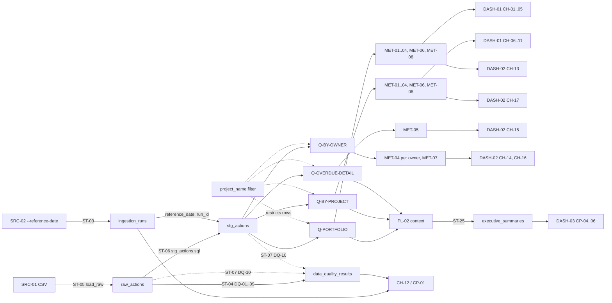
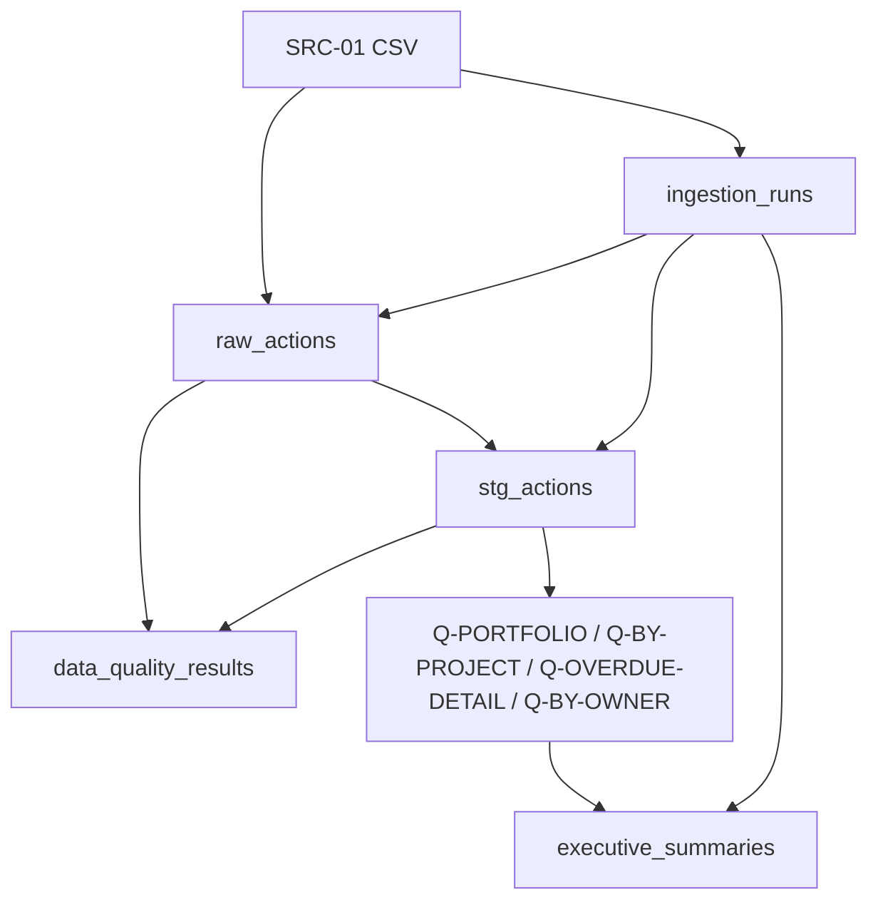

# Lineage Documentation

```yaml
doc_id: lineage
filename: LINEAGE.md
version: 1.0.0
status: draft
depends_on: [metric_logic, pipeline_spec, data_model_spec, dashboard_spec]
also_references: [metric_spec, report_spec, ai_model_spec, analytics_changelog]
generated_from: ddd-data-analytics v2.8.0
project: Cybersecurity Project Action Dashboard
```

เอกสารนี้เป็นเจ้าของ **lineage** (ตัวเลขมาจากไหน — มองย้อนกลับ) และ **impact analysis** (ถ้าต้นทางเปลี่ยนจะพังอะไร — มองไปข้างหน้า) เท่านั้น นิยาม metric อยู่ที่ METRIC_SPEC / METRIC_LOGIC, schema อยู่ที่ DATA_MODEL_SPEC, pipeline อยู่ที่ PIPELINE_SPEC, chart อยู่ที่ DASHBOARD_SPEC, ประวัติการเปลี่ยนแปลงอยู่ที่ ANALYTICS_CHANGELOG (อ้างอิงอย่างเดียว ไม่ซ้ำที่นี่) ID ทั้งหมด (`MET-*`, `Q-*`, `PL-*`, `ST-*`, `DASH-*`, `CH-*`, `DQ-*`) ใช้ตามเอกสารเจ้าของ

> **สถานะ (2026-10-02):** โค้ดและ `sql/` มีแล้ว (`src/ingest.py` -> `raw_actions` -> `stg_actions` -> `sql/20_metrics/q_*.sql` ผ่าน `src/metrics.py` -> dashboard/`src/ai/context_builder.py`) lineage ด้านล่างเขียนจากสเปกและ **ตรวจกับโครงสร้างไฟล์จริงด้วยการอ่านโค้ด** แต่ไม่ได้ extract อัตโนมัติจาก query log/catalog; `app_config` ถูกเขียนแต่ไม่มีผู้อ่าน (ไม่อยู่ใน lineage ของ metric ใด)

## Metric-to-Source Traces

### Source systems (ตาม PIPELINE_SPEC "Source Systems")

| ID | Source | บทบาท |
|---|---|---|
| SRC-01 | Weekly Action Item CSV (`src/tee_cybersecurity_actions_mock.csv`; 6 คอลัมน์) | แหล่งข้อมูลธุรกิจเพียงแหล่งเดียว; ไม่มี API/CDC/source timestamp |
| SRC-02 | พารามิเตอร์ `--reference-date` (CLI ของ PL-01) | ไม่ใช่ข้อมูลจากระบบ แต่เป็น **ต้นทางของ flag `is_overdue`/`days_overdue`** จึงต้องอยู่ใน lineage (ค่า = `2026-10-02` fixed constant สำหรับ iteration 1 ผู้ใช้ยืนยันแล้ว — CON-06; เปลี่ยนได้ผ่าน ANALYTICS_CHANGELOG เท่านั้น, breaking สำหรับ MET-04/MET-05) |
| SRC-03 | DuckDB (ผล Q-*) | ต้นทางของ PL-02 เท่านั้น (ไม่ใช่ source ภายนอก); context ที่ส่งออกไป OpenRouter = aggregate + top-N overdue rows (รวม `owner` ตามการตัดสินใจผู้ใช้; DPO/residency open) |

### Lineage diagram (end-to-end)



### Metric trace (metric → Q → table → source)

| Metric | Query (METRIC_LOGIC) | Flag / expression ใน `stg_actions` | ← `raw_actions` column | ← Source | Chart (DASHBOARD_SPEC) |
|---|---|---|---|---|---|
| MET-01 `total_actions` | Q-PORTFOLIO, Q-BY-PROJECT | `COUNT(*)` (grain `run_id`,`action_id`) | `action_id` (นับแถว) | SRC-01 `action_id` | CH-01, CH-06, CH-11 |
| MET-02 `completed_actions` | Q-PORTFOLIO, Q-BY-PROJECT | `is_completed` | `status` | SRC-01 `status` | CH-02, CH-07, CH-11 |
| MET-03 `open_actions` | Q-PORTFOLIO, Q-BY-PROJECT | `is_open` | `status` | SRC-01 `status` | CH-03, CH-11 |
| MET-04 `overdue_actions` | Q-PORTFOLIO, Q-BY-PROJECT, Q-BY-OWNER | `is_overdue` | `status`, `due_date_raw` | SRC-01 `status`, `due_date` + **SRC-02** | CH-04, CH-08, CH-11, CH-13, CH-16, CH-17 |
| MET-05 `days_overdue` | Q-OVERDUE-DETAIL | `days_overdue` | `status`, `due_date_raw` | SRC-01 `status`, `due_date` + **SRC-02** | CH-15 |
| MET-06 `completion_rate` (optional) | Q-PORTFOLIO (CH-05), Q-BY-PROJECT | `is_completed` / `COUNT(*)` | `status` | SRC-01 `status` | CH-05, CH-10, CH-11 |
| MET-07 `owners_with_overdue_actions` (draft) | Q-BY-OWNER | `COUNT(DISTINCT owner)` บนแถว `is_overdue` | `owner`, `status`, `due_date_raw` | SRC-01 `owner`, `status`, `due_date` + **SRC-02** | CH-14 |
| MET-08 `open_not_overdue_actions` (draft) | Q-PORTFOLIO, Q-BY-PROJECT | `is_open AND NOT is_overdue` (= MET-03 − MET-04) | `status`, `due_date_raw` | SRC-01 `status`, `due_date` + **SRC-02** | CH-09 |

ทุก Q-* รับพารามิเตอร์ `project_name` (NULL / `All Projects` = ทั้งหมด) ซึ่ง **จำกัดแถว** ของ `stg_actions` ก่อน aggregate; `reference_date` อ่านจาก run ไม่ใช่จาก filter (กระทบเฉพาะขอบเขต scope ไม่เปลี่ยนสูตร)

ทุก metric ผูกกับ `run_id` ผ่าน `latest_run.sql` (`ingestion_runs.status='succeeded'`) ซึ่งเป็นอีกหนึ่งขอบเขตของ lineage

### Column-level lineage

| Source column (SRC-01) | `raw_actions` | `stg_actions` | ใช้ใน | หมายเหตุการแปลง |
|---|---|---|---|---|
| `action_id` | `action_id` | `action_id` | MET-01; Q-OVERDUE-DETAIL; DQ-02/03 | copy; ไม่ trim |
| `project_name` | `project_name` | `project_name` | GROUP BY Q-BY-PROJECT; พารามิเตอร์ `project_name` ของทุก Q-* (restrict rows); filter FR-07; DQ-04 | copy |
| `action_name` | `action_name` | `action_name` | Q-OVERDUE-DETAIL → CH-15; DQ-05 | copy (confidential) |
| `owner` | `owner` | `owner` | Q-BY-OWNER, Q-OVERDUE-DETAIL → CH-14..16; DQ-06 | copy (pseudonymous) |
| `due_date` | `due_date_raw` (VARCHAR) | `due_date` (DATE) | `is_overdue`, `days_overdue`; DQ-07 | `strptime(...,'%Y-%m-%d')` |
| `status` | `status` | `status` | `is_completed`, `is_open`, `is_overdue`; DQ-08/09 | copy; derived 3 flags |
| (ระบบ) | `source_row_number`, `loaded_at` | `loaded_at` | DQ-10 / reconcile | ไม่มีใน source |
| SRC-02 → `ingestion_runs.reference_date` | — | `is_overdue`, `days_overdue` (derived) | MET-04, MET-05, `executive_summaries.reference_date` | `stg_actions` **ไม่มี column `reference_date`** |

| Derived column ใน `stg_actions` | ← input columns |
|---|---|
| `is_completed` | `status` |
| `is_open` | `status` |
| `is_overdue` | `status`, `due_date`, `ingestion_runs.reference_date` |
| `days_overdue` | `due_date`, `ingestion_runs.reference_date`, `is_overdue` condition |

**`executive_summaries` (bonus):** `source_run_id` ← `ingestion_runs.run_id`; `reference_date` ← `ingestion_runs.reference_date`; `project_filter` ← input ผู้ใช้ (CP-02); `provider` / `model_name` ← constant `provider='openrouter'` / `model_name='anthropic/claude-sonnet-5'` (โค้ด; ไม่ใช่ env; key = env `OPENAI_API_KEY` ไม่เก็บใน DB); `prompt_version` ← config โค้ด; `summary_text` ← AI provider output จาก context (Q-PORTFOLIO, Q-BY-PROJECT, Q-OVERDUE-DETAIL) ตัวเลขใน text **ไม่ใช่ metric** และยังไม่ผ่านการ reconcile กับ MET-*

## Table-level Lineage

### Source → Staging → Intermediate → Mart

| Layer | Table | Writer | อ่านจาก |
|---|---|---|---|
| Source | SRC-01 CSV | producer (ภายนอก) | — |
| Control | `ingestion_runs` | PL-01 ST-03 / ST-08 | SRC-02, hash ของ SRC-01 |
| Raw | `raw_actions` | PL-01 ST-05 | SRC-01 |
| Quality | `data_quality_results` | PL-01 ST-04, ST-07 | `raw_actions`, `stg_actions`, `ingestion_runs` |
| Staging (analytic fact) | `stg_actions` | PL-01 ST-06 | `raw_actions` + `ingestion_runs` |
| Intermediate | **ไม่มี** (ไม่มีตารางกลางระหว่าง `stg_actions` กับ Q-*) | — | — |
| Mart | **ไม่มี materialized mart**; Q-PORTFOLIO / Q-BY-PROJECT / Q-OVERDUE-DETAIL / Q-BY-OWNER เป็น query สด (ไม่ใช่ table/view) | Dash data access layer | `stg_actions` |
| Output (bonus) | `executive_summaries` | PL-02 ST-25 | ผลของ Q-* ผ่าน context |

`app_config` `[DESIGN PROPOSAL]` ไม่อยู่ใน data flow ของ metric

### Table dependency DAG



### Refresh order

ลำดับของ PL-01 (run-based append; ไม่ refresh ตารางเดิม): `ingestion_runs` (ST-03, status `running`) → `data_quality_results` (ST-04) → `raw_actions` (ST-05) → `stg_actions` (ST-06) → `data_quality_results` DQ-10 (ST-07) → `ingestion_runs` finalize (ST-08) จากนั้น Q-* อ่านได้เมื่อ run เป็น `succeeded` เท่านั้น; PL-02 (`executive_summaries`) ต้องรอ PL-01 มี run `succeeded` ก่อน Dashboard ไม่ต้อง refresh — query ทุกครั้งตาม latest `run_id` ถ้า DQ blocking พบ ST-05/06 ไม่ทำงาน (`stg_actions` = 0 แถวสำหรับ run นั้น)

## Impact Analysis Matrix

**Lineage ≠ Impact Analysis:** ส่วนบน (lineage) ตอบว่าตัวเลขมาจากไหน ส่วนนี้ตอบล่วงหน้าว่าถ้าต้นทางเปลี่ยนอะไรจะเสียหาย — ใช้ก่อนลงมือเปลี่ยน ไม่ใช่หลังเกิดเหตุ (changelog จดสิ่งที่เปลี่ยนแล้ว อยู่ที่ ANALYTICS_CHANGELOG)

### Source × Metric / Dashboard

ตัวอักษร: **H** = ค่าผิดหรือคำนวณไม่ได้ / **S** = ค่าเปลี่ยนโดยไม่ error (silent) / **-** = ไม่กระทบ

| Source / input | MET-01 | MET-02 | MET-03 | MET-04 | MET-05 | MET-06 | MET-07 | MET-08 | DASH-01 | DASH-02 | DASH-03 |
|---|---|---|---|---|---|---|---|---|---|---|---|
| SRC-01 `action_id` | S | - | - | - | - | - | - | - | CH-01, 06, 11 | CH-15 (hidden id) | context |
| SRC-01 `project_name` | S | S | S | S | - | S | - | S | CH-05..11 | CH-14..17 | context, filter (พารามิเตอร์ `project_name` restrict ทุก Q-*) |
| SRC-01 `owner` | - | - | - | S (ต่อ owner) | - | - | H | - | - | CH-14, 15, 16 | context |
| SRC-01 `status` | S | H | H | H | H | H | H | H | CH-02..05, 07..11 | CH-13..17 | context |
| SRC-01 `due_date` | - | - | - | H | H | - | H | H | CH-04, 08, 11 | CH-13..17 | context |
| SRC-02 reference date | - | - | - | S | S | - | S | S | CH-04, 08, 11 | CH-13..17 | `reference_date`, context |
| SRC-03 DuckDB / Q-* | - | - | - | - | - | - | - | - | - | - | PL-02 context |
| OpenRouter -> `anthropic/claude-sonnet-5` (ภายนอก) | - | - | - | - | - | - | - | - | - | - | CP-04, 06 เท่านั้น |

### Blast Radius Score (ordinal, ไม่ใช่ตัวเลข calibrate)

เกณฑ์: **Critical** = กระทบ ≥ 5 metric หรือหยุด pipeline ทั้ง run (blocking DQ); **High** = กระทบ 2-4 metric; **Medium** = 1 metric หรือ dimension; **Low** = ไม่กระทบ metric นับระดับเกณฑ์นี้เป็นข้อเสนอเพื่อจัดลำดับความสำคัญ ไม่ใช่ threshold ที่ calibrate (ถ้าองค์กรต้องการเกณฑ์เชิงตัวเลข = `null`; owner `{{DATA_STEWARD}}`)

| Source | Score | เหตุผล |
|---|---|---|
| SRC-01 `status` | Critical | กระทบ MET-02..08 ทุกตัว + flag ทั้ง 3 ใน `stg_actions` |
| SRC-01 `due_date` | High | MET-04, MET-05, MET-07, MET-08 (+ DQ-07 blocking หยุดทั้ง run) |
| SRC-02 reference date | High | MET-04, MET-05, MET-07, MET-08; **เปลี่ยนแบบ silent** (ไม่มี DQ rule จับ) |
| SRC-01 header/ชื่อคอลัมน์ | Critical | DQ-01 blocking ทั้ง run ไม่มี run ใหม่ |
| SRC-01 `project_name` | Medium | dimension; กระทบจำนวนแถว CH-06..11 และ invariant Q-BY-PROJECT = Q-PORTFOLIO |
| SRC-01 `owner` | Medium | KPI-03 (MET-07, CH-14, 16) ขอบเขตแคบ |
| SRC-01 `action_id` | Medium | MET-01 และ DQ-02/03 |
| OpenRouter / AI provider | Low (ต่อ metric) | กระทบ DASH-03 เท่านั้น |

### Blast radius ต่อ pipeline

| Pipeline | ตารางที่เขียน | Downstream |
|---|---|---|
| PL-01 `csv_ingest` | `ingestion_runs`, `raw_actions`, `stg_actions`, `data_quality_results` | MET-01..08 ทั้งหมด, DASH-01, DASH-02, CH-12 และ PL-02 (ทางอ้อม) ล้มเหลว = run `failed` ไม่เป็น latest ⇒ dashboard แสดง run ก่อนหน้า |
| PL-02 `executive_summary_generate` | `executive_summaries` | DASH-03 เท่านั้น; ไม่มี metric หรือ DASH-01/02 อ่านตารางนี้ |

### สถานการณ์ upstream change (ตัวอย่างที่ต้องตอบได้)

| การเปลี่ยน | จุดตรวจจับ | ผลกระทบ | การกระทำก่อนเปลี่ยน |
|---|---|---|---|
| **เปลี่ยน REFERENCE_DATE** (ปัจจุบัน fixed constant `2026-10-02`; เปลี่ยนได้ผ่าน changelog เท่านั้น) | ไม่มี DQ rule; เห็นได้ที่ `ingestion_runs.reference_date` | MET-04, MET-05, MET-07, MET-08 เปลี่ยนค่า → CH-04, 08, 09, 11, 13..17 และตัวเลขที่ DASH-03 อ้าง; MET-01..03, 06 ไม่เปลี่ยน; ตัวเลขอ้างอิงที่ค่าเดิมใช้ต่อไม่ได้ (breaking สำหรับ MET-04/MET-05) | สร้าง run ใหม่ ห้ามแก้ run เดิม (idempotency key = `source_hash` + `reference_date`); `executive_summaries` เดิมผูก `source_run_id` เก่า จึงยังเป็น provenance ถูกต้อง แต่ stale; บันทึกใน ANALYTICS_CHANGELOG |
| **status ค่าใหม่** (เช่น `blocked`) | DQ-09 (`investigation`) | โหลดต่อ; `status != 'done'` ⇒ นับเป็น open/overdue ทันที (MET-03/04/05 เพิ่ม, MET-06 ไม่เพิ่ม) โดยไม่มี error; CH-15 แสดงค่าใหม่ตามที่เก็บ | ตัดสินความหมายก่อน; เพิ่มใน enum `action_status` ที่ DATA_MODEL_SPEC (เจ้าของ enum) แล้วอัปเดต flag ใน `stg_actions.sql`; ข้อจำกัด: ความหมายเปลี่ยนโดยใช้ค่าเดิมตรวจไม่ได้ |
| **เปลี่ยนชื่อ/ลบ column ต้นทาง** (เช่น `owner` → `assignee`) | DQ-01 `blocking` | run `failed`; ไม่มี raw/stg ใหม่ dashboard ค้างที่ run เดิม (stale) | ปรับ DATA_CONTRACT, ST-05 mapping, `raw_actions`, SQL, Q-*, CH ที่อ้าง (CH-14..16 ถ้าเป็น `owner`) ก่อนส่งไฟล์ใหม่ |
| **เปลี่ยนรูปแบบ `due_date`** | DQ-07 `blocking` | run `failed` | ปรับ `strptime` format ใน `stg_actions.sql` + DQ-07 |
| **เพิ่ม column** | DQ-01 `warning` | ไม่กระทบ metric | แจ้งชื่อ column; ตัดสินใจก่อนใช้ |
| **action_id ซ้ำ/ว่าง** | DQ-02/03 `blocking` | run `failed` | ปฏิเสธไฟล์ตามนโยบาย DATA_QUALITY |

## Breaking Change Impact

### Change Impact Assessment (checklist)

- [ ] ระบุ layer ที่เปลี่ยน: SRC-01 / SRC-02 / `raw_actions` / `stg_actions` / Q-* / MET-* / CH-*
- [ ] หา downstream จากตาราง Source × Metric / Dashboard และ Metric Trace ข้างต้น (ไม่เดา)
- [ ] ตรวจว่ากระทบ flag ใน `stg_actions` หรือไม่ (flag เปลี่ยน = ทุก Q-* ที่อ่านมันเปลี่ยน) และ invariant Q-BY-PROJECT = Q-PORTFOLIO
- [ ] ตรวจว่าเป็น silent change (ไม่มี DQ rule จับ) หรือไม่ ถ้าใช่ ต้องมี reviewer ก่อน merge
- [ ] ยืนยันว่า run เก่าไม่ถูกแก้ย้อนหลัง (ตาม Restatement Policy ของ METRIC_LOGIC) ใช้ run ใหม่
- [ ] อัปเดตเอกสารเจ้าของ (METRIC_SPEC / METRIC_LOGIC / DATA_MODEL_SPEC / PIPELINE_SPEC / DASHBOARD_SPEC) ก่อน แล้วค่อย index ที่อื่นตาม ID
- [ ] บันทึก entry ใน ANALYTICS_CHANGELOG; แจ้ง consumer ตามรายการด้านล่าง
- [ ] รัน test ที่เกี่ยวข้องใน TESTING_STRATEGY (T-D* สำหรับ dashboard, T-A* สำหรับ DASH-03)

### Downstream consumers

| Consumer | ประเภท | อ่านจาก | สถานะเอกสาร |
|---|---|---|---|
| DASH-01 (CH-01..CH-12) | Dashboard | `stg_actions` ผ่าน Q-PORTFOLIO, Q-BY-PROJECT (ทั้งคู่รับ `project_name`); `ingestion_runs`, `data_quality_results` | DASHBOARD_SPEC |
| DASH-02 (CH-13..CH-17) | Dashboard | Q-PORTFOLIO, Q-OVERDUE-DETAIL, Q-BY-OWNER, Q-BY-PROJECT | DASHBOARD_SPEC |
| DASH-03 (CP-01..CP-06) | Dashboard (bonus, draft) | `executive_summaries`; context จาก Q-* | DASHBOARD_SPEC |
| Report RPT-01 / RPT-02 | Report (`proposed`) | Q-PORTFOLIO, Q-BY-PROJECT, Q-OVERDUE-DETAIL, Q-BY-OWNER (RPT-01); `executive_summaries` (RPT-02) | [REPORT_SPEC.md](REPORT_SPEC.md) |
| AI summary (PL-02 / prompt; MDL-01) | AI | Q-PORTFOLIO, Q-BY-PROJECT, Q-OVERDUE-DETAIL | [AI_MODEL_SPEC.md](AI_MODEL_SPEC.md) |

### Migration plan (สำหรับ downstream consumers)

1. **แจ้งล่วงหน้า:** แจ้ง owner ของ DASH-01..03 (`{{DASHBOARD_DEVELOPER}}`, `{{DATA_STEWARD}}`) พร้อมรายการ ID ที่กระทบ ระยะแจ้งล่วงหน้า = `null` (calibration: ข้อตกลงกับ stakeholder; owner `{{PROJECT_SPONSOR}}`)
2. **Additive ก่อน breaking:** เพิ่ม column/ค่าใหม่คู่กับของเดิม แล้วย้าย consumer ทีละตัว; ห้ามลบของเดิมจนทุก Q-*/CH ที่อ้างถูกย้าย
3. **Run ใหม่ ไม่ rewrite:** โหลดด้วยสเปกใหม่เป็น run ใหม่ ตรวจ reconcile (DQ-10 และ Q-BY-PROJECT = Q-PORTFOLIO) และเทียบกับ run เดิมก่อนให้ dashboard ใช้ (latest successful run จะเลือกให้อัตโนมัติ)
4. **Rollback:** run เก่ายังอยู่ใน `stg_actions` (key `run_id`) — ย้อนกลับโดยไม่ลบ run ใหม่ด้วยการเลือก run ตาม `run_id` ตามขั้นตอนใน RUNBOOK; ข้อเท็จจริง: logic ปัจจุบันเลือก `max(run_id)` ที่ `succeeded` จึงต้องมีกลไก pin run `[DESIGN PROPOSAL]` หากต้อง rollback โดยไม่ลบ
5. **ปิดงาน:** บันทึก ANALYTICS_CHANGELOG; อัปเดตเอกสารเจ้าของ; ตรวจ `executive_summaries` เก่าที่ผูก run/reference date เดิมว่าจะ label stale หรือไม่

## Discrepancies ที่พบ (สถานะหลัง reconcile)

1. **REFERENCE_DATE:** ปิดแล้ว — `2026-10-02` = fixed constant สำหรับ iteration 1 (ผู้ใช้ยืนยัน; overdue 3,531 / max `days_overdue` 46 เป็นค่า informational) เอกสารนี้ไม่ hardcode วันที่ใน logic — ใช้ `ingestion_runs.reference_date` เท่านั้น ค่าเดิม `2026-10-01` ถูก supersede และเหลือเป็นบันทึกประวัติใน ANALYTICS_CHANGELOG เท่านั้น
2. **CH-14** map กับ MET-07 `owners_with_overdue_actions` (draft; KPI-03) ผ่าน Q-BY-OWNER — ปิดแล้ว
3. **CH-09** un-defer แล้ว map กับ MET-08 `open_not_overdue_actions` (draft; KPI-02) — ปิดแล้ว (`intermediate`; view ที่ผู้ใช้เปิดเอง ตาม Gate Rule)
4. **CH-05** map กับ MET-06 ผ่าน Q-PORTFOLIO (`completion_rate`) — ปิดแล้ว
5. **ไม่มีไฟล์ `sql/`** — lineage เป็น design ยังไม่ได้ verify กับ implementation จริง (ยังเปิดอยู่)
6. REPORT_SPEC และ AI_MODEL_SPEC มีแล้ว — ตาราง Downstream consumers อัปเดตแล้ว
