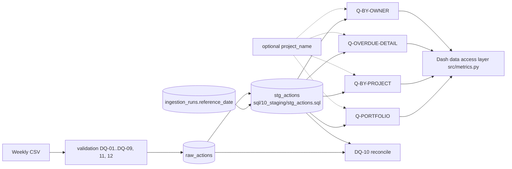

# Metric Logic Spec (SQL)

```yaml
doc_id: metric_logic
filename: METRIC_LOGIC.md
version: 1.0.0
status: draft
depends_on: [metric_spec, data_model_spec]
generated_from: ddd-data-analytics v2.8.0
project: Cybersecurity Project Action Dashboard
```

เอกสารนี้ map metric ทุกตัวใน METRIC_SPEC.md (MET-01..MET-08) ไปเป็น SQL (DuckDB) ชื่อตาราง/column ยึดตาม DATA_MODEL_SPEC.md ทุกตัว; นิยามเชิงธุรกิจและสูตรอยู่ที่ METRIC_SPEC.md (ไม่ซ้ำที่นี่)

> **สถานะการ implement/ยืนยัน (2026-10-02):** SQL ด้านล่าง implement แล้วเป็นไฟล์จริงใต้ `sql/` (`10_staging/stg_actions.sql`, `20_metrics/latest_run.sql`, `q_portfolio.sql`, `q_by_project.sql`, `q_overdue_detail.sql`, `q_by_owner.sql`) เรียกผ่าน `src/metrics.py` ซึ่งเป็น data access layer เดียว (named parameter ผูกค่า ไม่ต่อสตริง) ตรวจแล้ว: golden fixture 12 แถวและ invariant ใน `tests/test_metrics.py`, `tests/test_reference_date.py`, เทียบกับตัวคำนวณอิสระ `tests/reference_calc.py` (T-F01) และ sample CSV จริง ตัวเลขที่ `REFERENCE_DATE = 2026-10-02`: total 14,013 / completed 8,597 / open 5,416 / overdue 3,531 / open_not_overdue 1,885 / owners_with_overdue 96 / max days_overdue 46 (P01 = 1,168 / 816 / 352 / 202) เป็นค่า informational ใช้ตรวจ reconcile เท่านั้น ห้าม hardcode ใน app บล็อก SQL ในเอกสารนี้เป็นความหมายบรรทัดฐาน — ไฟล์จริงอาจต่างเรื่องรูปแบบ (ไฟล์ใน `sql/` ชนะเมื่อขัดกัน)

## กฎ Reference Date และการเลือก run (ใช้กับทุก metric)

1. **Reference date มีที่มาเดียว:** `ingestion_runs.reference_date` ของ run (ส่งโดย `--reference-date`; `REFERENCE_DATE = 2026-10-02` = ค่าคงที่ที่ผู้ใช้ยืนยันสำหรับ iteration 1; เปลี่ยนได้ผ่านรายการใน ANALYTICS_CHANGELOG เท่านั้น (breaking สำหรับ MET-04/MET-05) — CON-06) ห้ามเรียก `date.today()` / `datetime.now().date()` / `current_date` ใน SQL หรือ Python ของ metric logic
2. **Flag ถูกคำนวณครั้งเดียวตอนสร้าง `stg_actions`** (stage `stg_actions.sql` ด้านล่าง) ด้วย reference date ของ run นั้น; query ของ metric จึงอ่านเฉพาะ flag และ **ไม่รับพารามิเตอร์วันที่** (reference date อ่านจากที่เก็บของ run เสมอ ไม่เคยมาจาก filter ของ dashboard) ผลคือ: เปลี่ยน reference date = ต้องสร้าง run ใหม่ (ไม่แก้ run เดิม) เพื่อให้ตัวเลขของแต่ละ run reproducible จาก `source CSV + reference date + SQL` (NFR-01)
3. **เลือก run:** ทุก query กรอง `run_id = :run_id` โดย `:run_id` มาจาก

```sql
-- sql/20_metrics/latest_run.sql (implement แล้ว)
SELECT max(run_id) AS run_id
FROM ingestion_runs
WHERE status = 'succeeded';   -- enum ingestion_run_status (DATA_MODEL_SPEC)
```

   ถ้าไม่มีแถว (ยังไม่เคยโหลดสำเร็จ) = empty state ไม่ใช่ error (DASHBOARD_SPEC) หมายเหตุ: "latest" ตาม `max(run_id)` = run ที่โหลดล่าสุด ไม่ใช่ไฟล์ที่ใหม่ที่สุดตามเนื้อหา — ดู Open Question 2
4. **due_date = reference_date ไม่ใช่ overdue** (`due_date < reference_date` เป็น strict inequality) และ **done ไม่เคยเป็น overdue**
5. **Project filter (D3):** ทุก Q-* รับพารามิเตอร์เลือกได้ `project_name` (named parameter `$project_name`; `NULL` = All Projects) และ **จำกัดแถว** ที่นับ/แสดง (ไม่ใช่แค่ highlight) data access layer (`src/metrics.py`) แปลงค่า label `All Projects` ของ UI เป็น `NULL` ก่อนเรียก; project ที่ไม่มีอยู่ = ผลว่าง/นับ 0 ไม่ error ส่วน `$run_id` คือ run จากกฎข้อ 3 (DuckDB named parameters; พารามิเตอร์ `?` แบบ positional ใน plan.md §10 เทียบเท่ากัน)
6. สูตรอยู่ใน SQL/data access layer เท่านั้น ห้ามเขียนซ้ำใน Dash callback (CON-08, NFR-03)

## Metric SQL Implementations

### Stage: สร้าง flag (`sql/10_staging/stg_actions.sql`)

Source tables: `raw_actions` (r), `ingestion_runs` (i) | Join: `r.run_id = i.run_id` | Filter: `r.run_id = :run_id` | Grain ผลลัพธ์: 1 แถวต่อ (`run_id`, `action_id`)

```sql
INSERT INTO stg_actions
WITH base AS (
  SELECT r.run_id, r.action_id, r.project_name, r.action_name, r.owner,
         CAST(strptime(r.due_date_raw, '%Y-%m-%d') AS DATE) AS due_date,
         r.status,
         i.reference_date,
         r.loaded_at
  FROM raw_actions r
  JOIN ingestion_runs i ON i.run_id = r.run_id
  WHERE r.run_id = :run_id
)
SELECT run_id, action_id, project_name, action_name, owner, due_date, status,
       (status = 'done')                                     AS is_completed,
       (status != 'done')                                    AS is_open,
       (status != 'done' AND due_date < reference_date)      AS is_overdue,
       CASE WHEN status != 'done' AND due_date < reference_date
            THEN date_diff('day', due_date, reference_date)
            ELSE 0 END                                       AS days_overdue,
       loaded_at
FROM base;
```

`days_overdue = 0` สำหรับ non-overdue เป็น placeholder ของ schema ไม่ใช่ค่า metric (MET-05 นิยามเฉพาะ overdue action)

### Metric Implementation Table

ทุก metric: **Source table** = `stg_actions`; **Join** = ไม่มี (query ตารางเดียว; `reference_date` ถูกฝังใน flag แล้ว จึงไม่ต้อง join `ingestion_runs`); **Required filter** = `run_id = :run_id`; **Optional filter** = `project_name = $project_name` (`NULL` = All Projects ตามกฎข้อ 5)

| Metric | SQL expression (ใน SELECT) | Extra WHERE | GROUP BY grain (METRIC_SPEC) |
|---|---|---|---|
| MET-01 `total_actions` | `COUNT(*)` | - | portfolio / `project_name` / `owner` / `status` / `due_date` |
| MET-02 `completed_actions` | `COUNT(*) FILTER (WHERE is_completed)` | - | portfolio / `project_name` / `owner` / `due_date` |
| MET-03 `open_actions` | `COUNT(*) FILTER (WHERE is_open)` | - | portfolio / `project_name` / `owner` / `status` / `due_date` |
| MET-04 `overdue_actions` | `COUNT(*) FILTER (WHERE is_overdue)` | - | portfolio / `project_name` / `owner` / `due_date` |
| MET-05 `days_overdue` | คอลัมน์ `days_overdue` ต่อแถว (ไม่ aggregate) | `is_overdue` | 1 overdue action (เรียง `days_overdue DESC, due_date ASC`) |
| MET-06 `completion_rate` (optional) | `CASE WHEN COUNT(*)=0 THEN 0 ELSE COUNT(*) FILTER (WHERE is_completed)::DOUBLE / COUNT(*) END` | - | portfolio / `project_name` |
| MET-07 `owners_with_overdue_actions` (draft; KPI-03) | `COUNT(DISTINCT owner) FILTER (WHERE is_overdue)` | - | portfolio (ภายใต้ filter `project_name` ถ้ามี) — **ไม่ additive ข้าม project** (owner คนเดียวอยู่ได้หลาย project) |
| MET-08 `open_not_overdue_actions` (draft; KPI-02) | `COUNT(*) FILTER (WHERE is_open AND NOT is_overdue)` (= `open_actions - overdue_actions`) | - | portfolio / `project_name` |

MET-07/MET-08 เป็นจำนวนนับล้วน ไม่มี threshold (นิยามธุรกิจอยู่ที่ METRIC_SPEC.md) status ที่ไม่รู้จักถูกนับเป็น open จึงเข้า MET-08 ตามกฎ Edge Case เดียวกับ MET-03

### Query ที่ใช้งานจริง (plan.md §10; ไฟล์ใน `sql/20_metrics/`)

**Q-PORTFOLIO — MET-01..MET-04, MET-06, MET-07, MET-08, portfolio** (`sql/20_metrics/q_portfolio.sql`; รับ `$run_id`, `$project_name` เลือกได้) — คืน 1 แถวเสมอ; `completion_rate` ให้ CH-05 มี query ระดับ portfolio

```sql
SELECT COUNT(*)                             AS total_actions,
       COUNT(*) FILTER (WHERE is_completed) AS completed_actions,
       COUNT(*) FILTER (WHERE is_open)      AS open_actions,
       COUNT(*) FILTER (WHERE is_overdue)   AS overdue_actions,
       COUNT(*) FILTER (WHERE is_open AND NOT is_overdue) AS open_not_overdue_actions,   -- MET-08
       COUNT(DISTINCT owner) FILTER (WHERE is_overdue)    AS owners_with_overdue_actions, -- MET-07
       CASE WHEN COUNT(*) = 0 THEN 0
            ELSE COUNT(*) FILTER (WHERE is_completed)::DOUBLE / COUNT(*) END AS completion_rate  -- MET-06
FROM stg_actions
WHERE run_id = $run_id
  AND ($project_name IS NULL OR project_name = $project_name);   -- NULL = All Projects (FR-07)
```

**Q-BY-PROJECT — MET-01..MET-04 + MET-06 + MET-08 ต่อ project** (`sql/20_metrics/q_by_project.sql`; รับ `$run_id`, `$project_name` เลือกได้ — ใส่ project = คืน 1 แถว; project ไม่มีอยู่ = 0 แถว)

```sql
SELECT project_name,
       COUNT(*)                             AS total_actions,
       COUNT(*) FILTER (WHERE is_completed) AS completed_actions,
       COUNT(*) FILTER (WHERE is_open)      AS open_actions,
       COUNT(*) FILTER (WHERE is_overdue)   AS overdue_actions,
       COUNT(*) FILTER (WHERE is_open AND NOT is_overdue) AS open_not_overdue_actions,
       CASE WHEN COUNT(*) = 0 THEN 0
            ELSE COUNT(*) FILTER (WHERE is_completed)::DOUBLE / COUNT(*) END AS completion_rate
FROM stg_actions
WHERE run_id = $run_id
  AND ($project_name IS NULL OR project_name = $project_name)
GROUP BY project_name
ORDER BY project_name;
```

**Q-OVERDUE-DETAIL — MET-05 + รายการ overdue** (`sql/20_metrics/q_overdue_detail.sql`; รับ `$run_id`, `$project_name` เลือกได้; ORDER BY เพิ่ม `action_id ASC` เป็น tie-break ให้ผลคงที่ — ไม่เปลี่ยนค่า metric)

```sql
SELECT action_id, project_name, action_name, owner, due_date, status, days_overdue
FROM stg_actions
WHERE run_id = $run_id
  AND is_overdue
  AND ($project_name IS NULL OR project_name = $project_name)
ORDER BY days_overdue DESC, due_date ASC, action_id ASC;  -- action_id = tie-break ให้ผลคงที่
```

**Q-BY-OWNER — MET-04/MET-05 ซอยด้วย `owner` (รองรับ KPI-03)** (`sql/20_metrics/q_by_owner.sql`; รับ `$run_id`, `$project_name` เลือกได้) — ใช้นับจำนวนเท่านั้น ห้ามให้ rank เป็น "คะแนนผลงาน" (CON-09); จำนวน owner ที่มี overdue ใช้ MET-07 จาก Q-PORTFOLIO (ไม่นับแถวผลนี้ในเลเยอร์ UI)

```sql
SELECT owner, COUNT(*) FILTER (WHERE is_overdue) AS overdue_actions
FROM stg_actions
WHERE run_id = $run_id
  AND ($project_name IS NULL OR project_name = $project_name)
GROUP BY owner
HAVING COUNT(*) FILTER (WHERE is_overdue) > 0
ORDER BY overdue_actions DESC, owner;
```

| Query | Metrics | Source tables | Join logic | Filters | GROUP BY |
|---|---|---|---|---|---|
| Q-PORTFOLIO | MET-01..04, MET-06, MET-07, MET-08 | `stg_actions` | none | `run_id`, optional `project_name` | none (1 แถว) |
| Q-BY-PROJECT | MET-01..04, MET-06, MET-08 | `stg_actions` | none | `run_id`, optional `project_name` | `project_name` |
| Q-OVERDUE-DETAIL | MET-05 | `stg_actions` | none | `run_id`, `is_overdue`, optional `project_name` | none (ระดับแถว) |
| Q-BY-OWNER | MET-04 (slice `owner`) | `stg_actions` | none | `run_id`, optional `project_name` | `owner` |

Invariant (TESTING_STRATEGY T-M11): ผลรวมของ Q-BY-PROJECT (all projects) = Q-PORTFOLIO สำหรับ MET-01..04 และ MET-08; ตอนใส่ `project_name` แถวของ Q-BY-PROJECT = ค่าของ Q-PORTFOLIO ที่ filter เดียวกัน **MET-07 ไม่ additive** (ผลรวมต่อ project อาจมากกว่า portfolio) จึงไม่อยู่ใน Q-BY-PROJECT และไม่เข้า invariant ผลรวม

## Edge Case Handling

Edge case คือจุดที่คนสองคนเห็นนิยามตรงกันบนกระดาษ แต่ได้ตัวเลขต่างกันในทางปฏิบัติ ตัดสินที่นี่ ไม่ปล่อยให้ SQL แต่ละไฟล์ตัดสินเอง

| Edge case | การจัดการ | อ้างอิง |
|---|---|---|
| `due_date = reference_date` | **ไม่ overdue** (`<` เท่านั้น) `days_overdue` = 0 | plan FR-05; METRIC_SPEC |
| `status = 'done'` และ due ผ่านแล้ว | ไม่ overdue; ไม่นับใน `open_actions` | glossary |
| due_date อยู่หลัง reference_date | ไม่ overdue (open ตามปกติ) | |
| `status` ไม่รู้จัก (ไม่อยู่ใน enum `action_status`) | นับเป็น open (`!= 'done'`) ตาม plan; **ไม่ map เอง**; DQ-09 สร้าง finding ระดับ `investigation` ให้คนตัดสิน | DATA_QUALITY |
| `status` ต่างตัวพิมพ์/มีช่องว่าง (เช่น `Done`, `done `) | ไม่ normalize เงียบ ๆ -> ถูกนับเป็น open และ DQ-09 จับได้ (ค่าไม่ตรง enum) — ผลคือ metric อาจ overcount open จนกว่าจะมีการตัดสินใจ | DQ-09 |
| ค่า NULL / ว่างใน field บังคับ | ไม่ควรเข้าถึง `stg_actions` เพราะ DQ-02..DQ-08 เป็น `blocking` และปฏิเสธไฟล์ทั้งไฟล์; SQL ไม่ใส่ `COALESCE` เพื่อปกปิด (ถ้า NULL หลุดมา `status != 'done'` ให้ NULL และแถวจะหายจาก flag — เป็นเหตุผลที่ต้อง block ก่อน) | DQ-02..08 |
| `due_date` parse ไม่ได้ / ไม่ใช่ ISO `YYYY-MM-DD` | `blocking` (DQ-07); stg ใช้ `strptime` รูปแบบเดียว ไม่ใช้ `TRY_CAST` ที่ยอมหลายรูปแบบ | DQ-07 |
| `action_id` ซ้ำใน input | `blocking` (DQ-03) เพื่อรักษา grain ของ `stg_actions` ไม่ให้นับซ้ำ | DQ-03 |
| scope ว่าง (project ไม่มี / run ไม่มีแถว) | `COUNT` = 0; `completion_rate` = 0 ตาม plan SQL — **0 กำกวมกับ 0% จริง** จึงให้ UI แสดง no-data state โดยตรวจ `total_actions = 0` (DASHBOARD_SPEC) | plan §10.2 |
| ยังไม่มี run สำเร็จ | `:run_id` เป็น NULL -> ไม่มีข้อมูล; แสดง empty state ไม่ crash | plan §23 Phase 9 |
| project filter ที่ไม่มีอยู่จริง | ผลว่าง ไม่ error (ทดสอบเป็น "bad project filter") | plan Phase 9 |
| Timezone / เวลา | ไม่เกี่ยว: `due_date`, `reference_date` เป็น DATE ปฏิทินล้วน; `loaded_at` ไม่เข้า metric | |
| Mid-month Churn / Proration / Currency Conversion | **N/A** — โดเมนนี้ไม่มี revenue, subscription, churn หรือสกุลเงิน (ตัวอย่างใน template ใช้ไม่ได้) | |

### Backdated Records

ไม่มี "period close" ในโดเมนนี้ แต่ละ CSV เป็น snapshot เต็มของ action ณ เวลาที่ส่ง การเปลี่ยน status/due_date ของ action เดิมในไฟล์สัปดาห์ถัดไป = **run ใหม่** ตัวเลขของ run เดิมไม่ถูกแก้ (run versioning, plan.md §17 Strategy B) การเทียบข้าม run ไม่ได้นิยามไว้ (ไม่ทราบว่า `action_id` คงที่ข้าม run — glossary)

### Late-Arriving Data

ไม่มีแนวคิดแถวมาช้าเข้ารอบเก่า: ไฟล์ที่มาถึงทีหลังเป็น run ใหม่และกลายเป็น latest successful run ทันที ค่า cutoff ที่หยุดรับไฟล์เก่า = `null` (calibration source: ข้อตกลงรอบการส่ง CSV กับ `{{MEETING_CHAIR}}`; owner `{{DATA_STEWARD}}`) ความเสี่ยงที่ทราบ: การโหลดไฟล์ที่เก่ากว่าทีหลัง จะทำให้ไฟล์เก่าเป็น "latest" — ต้องตัดสินใน Open Question 2

### Restatement Policy

- Metric ของ run ที่รายงานไปแล้ว **ไม่ถูกแก้เงียบ ๆ**: run เดิมคงอยู่ (immutable); การโหลดใหม่ = run ใหม่พร้อม `run_id`, `source_hash`, `reference_date`
- **การเปลี่ยนนิยาม metric** (เช่น ถือ `due_date = reference_date` เป็น overdue) = breaking change ต้องมีรายการใน ANALYTICS_CHANGELOG.md พร้อม effective date และการตัดสินว่าจะ rebuild `stg_actions` ของ run เก่าจาก `raw_actions` (restate) หรือเก็บนิยามเก่าคู่กัน; ผู้อนุมัติ = `{{KPI_OWNER_ROLE}}` / `{{PROJECT_SPONSOR}}`; ผลตัดสินเริ่มต้น = `null` (ยังไม่มี metric ที่ certified)
- `REFERENCE_DATE` = `2026-10-02` เป็นค่าคงที่ของ iteration 1; การเปลี่ยนค่านี้ทำให้ MET-04/MET-05 เปลี่ยน (**breaking**): ต้องทำเป็น run ใหม่ + บันทึกใน ANALYTICS_CHANGELOG.md ค่าเดิม `2026-10-01` (overdue 3,145 / max 45) ถูกแทนที่แล้ว — บันทึก supersession อยู่ที่ ANALYTICS_CHANGELOG ไม่ใช่ค่า normative

## Transformation Dependencies



| Layer | Model | ที่มา | หมายเหตุ |
|---|---|---|---|
| Staging | `stg_actions` | `raw_actions` + `ingestion_runs.reference_date` | materialized table; ที่เดียวที่มีสูตร flag |
| Intermediate | ไม่มี | - | โดเมนนี้ไม่ต้องการชั้นกลาง (query ตารางเดียว) |
| Mart | `q_portfolio.sql`, `q_by_project.sql`, `q_overdue_detail.sql`, `q_by_owner.sql` (หนึ่งไฟล์ต่อ Q-*; `latest_run.sql` เลือก run) | `stg_actions` | เป็น parameterized query ไม่ใช่ materialized table; `src/metrics.py` เรียกผ่าน data access layer |

ไม่ใช้ dbt (CON-03) — การรันและลำดับโดย `src/ingest.py` (รายละเอียดที่ PIPELINE_SPEC.md) Dashboard ต้องเรียก query เหล่านี้ ไม่เขียนสูตรใหม่ (CON-08)

## Open Questions

1. ~~"Owners with Overdue Actions"~~ — **ตัดสินแล้ว (D4):** เป็น MET-07 `owners_with_overdue_actions` (KPI-03; draft) ไม่ใช่ค่า display-only
2. กฎเลือก "latest successful run": `max(run_id)` (ลำดับการโหลด) เหมาะสมหรือไม่ หากมีการโหลดไฟล์เก่าย้อนหลัง? (ตัวเลือกอื่น: reference_date ล่าสุด)
3. ~~ยืนยัน `REFERENCE_DATE`~~ — **ตัดสินแล้ว (D1):** `2026-10-02` ค่าคงที่ iteration 1
4. นโยบาย normalize ของ `status` (trim/ตัวพิมพ์) — ปัจจุบัน = ไม่ normalize, ให้ DQ-09 จับ
