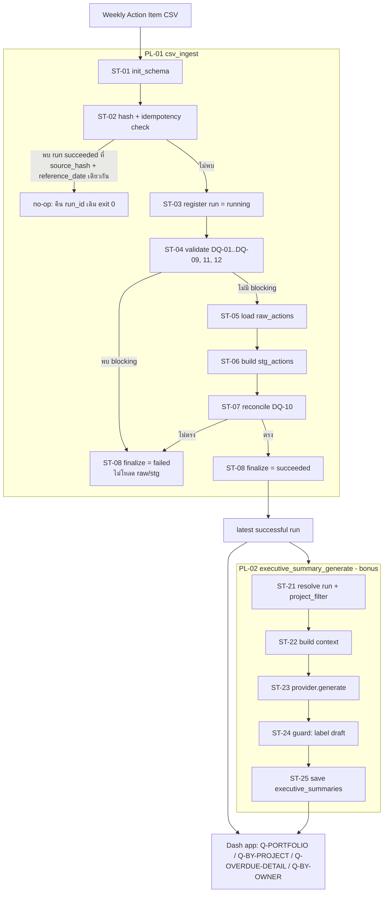

# Pipeline Spec

```yaml
doc_id: pipeline_spec
filename: PIPELINE_SPEC.md
version: 1.0.0
status: draft
depends_on: [data_model_spec, metric_logic]
generated_from: ddd-data-analytics v2.8.0
project: Cybersecurity Project Action Dashboard
```

เอกสารนี้นิยาม pipeline ที่สร้างทุกตารางใน DATA_MODEL_SPEC.md และรัน SQL จาก METRIC_LOGIC.md ไม่ซ้ำนิยามที่นั่น (อ้างด้วย ID)

> **สถานะการ implement/ยืนยัน (2026-10-02):** PL-01 implement แล้วใน `src/ingest.py`, `src/validation.py`, `src/db.py`, `sql/` และมี test (ดู TESTING_STRATEGY: `test_ingest.py`, `test_idempotency.py`, `test_validation.py`, `test_hardening_ingest.py`) — ingest ไฟล์ sample จริง 14,013 แถวที่ `--reference-date 2026-10-02` ผ่านและตรงตัวเลข informational PL-02 implement แล้วใน `src/ai/` (context_builder, prompt, provider, summary_service) pytest ใช้ **mocked HTTP เท่านั้น** และเรียก OpenRouter จริงด้วย key จริงสำเร็จ 2 ครั้งผ่าน callback Generate ของแอป (2026-10-02; `anthropic/claude-sonnet-5`, `exec-summary-v2`, latency ราว 21-25 วินาที; ยังไม่ได้ประเมิน EV-01..EV-05) ไม่มี scheduler/cron/alert (on-demand ด้วยมือ) `[DESIGN PROPOSAL]` ที่เหลือในเอกสารคือสิ่งที่ plan ไม่ได้กำหนดและโค้ดเลือกไว้ (ยังรอการยืนยัน)
> **`app_config`:** ตารางถูก **เขียน** ที่ ST-08 (`reference_date` ของ run ที่สำเร็จล่าสุด) แต่ **ไม่มีโค้ดส่วนใดอ่าน** — dashboard/metrics อ่าน `reference_date` จาก `ingestion_runs` (ตัวแหล่งความจริง) ถือเป็น vestigial/informational

## Pipeline Overview

### Pipeline Inventory

| Pipeline ID | ชื่อ | วัตถุประสงค์ | ตารางที่สร้าง/เขียน | Trigger |
|---|---|---|---|---|
| PL-01 | `csv_ingest` | รับ CSV Action Item รายสัปดาห์ -> validate -> raw -> stg พร้อม reconcile | `ingestion_runs`, `raw_actions`, `stg_actions`, `data_quality_results` (+ อ่าน `app_config` ถ้ามี) | CLI `python -m src.ingest` (manual หลังประชุม) |
| PL-02 | `executive_summary_generate` (bonus) | สร้าง Executive Summary draft จาก DuckDB ผ่าน AI provider แล้วบันทึก | `executive_summaries` | ปุ่ม Generate Draft ใน Dash (on-demand) |

Coverage: ทุกตารางใน DATA_MODEL_SPEC มี pipeline ที่เขียน: `ingestion_runs`/`raw_actions`/`stg_actions`/`data_quality_results` = PL-01; `executive_summaries` = PL-02; `app_config` = เขียนโดย PL-01 เฉพาะถ้ายังคงมีตารางนี้ (DATA_MODEL_SPEC Open Question 3) ส่วน query metric (Q-*) ใน METRIC_LOGIC เป็น read path ของ dashboard ไม่ใช่ pipeline เขียนข้อมูล

### Pipeline DAG



### Technology Stack

| ชั้น | เครื่องมือ | อ้างอิง |
|---|---|---|
| Orchestration | ไม่มี scheduler/orchestrator — CLI `src/ingest.py` (Python) | CON-03, CON-04 |
| Transform | SQL files ใต้ `sql/` รันโดย `src/ingest.py` (ไม่ใช้ dbt) | CON-03 |
| Warehouse | DuckDB (`data/cybersecurity.duckdb`) | CON-01 |
| Validation | `src/validation.py` (Python) + `sql/30_quality/quality_checks.sql` | plan.md §8 |
| BI | Plotly Dash + Dash AG Grid | CON-02 |
| Test | pytest (TESTING_STRATEGY.md) | CON-05 |

## Pipeline Definitions

### PL-01 csv_ingest

**CLI (design)**

```bash
python -m src.ingest --input src/tee_cybersecurity_actions_mock.csv --reference-date 2026-10-02
```

| Argument | จำเป็น | ความหมาย |
|---|---|---|
| `--input PATH` | ใช่ | พาธ CSV (UTF-8; รับ BOM) |
| `--reference-date YYYY-MM-DD` | ใช่ | เก็บใน `ingestion_runs.reference_date`; **ไม่มี default เป็นวันที่ปัจจุบัน** (CON-06); รูปแบบผิด = error ก่อนเขียน DB |
| `--db PATH` | ไม่ | default `data/cybersecurity.duckdb` (ไม่ commit) |

Exit code (implemented + มี test): `0` = สำเร็จหรือ no-op (idempotent); `1` = ไฟล์ถูกปฏิเสธเพราะ `blocking` หรือ reconcile ล้มเหลว (run = `failed`); `2` = argument ผิด / ไฟล์อ่านไม่ได้ / ไม่ใช่ UTF-8 / **ไฟล์เกิน `INGEST_MAX_BYTES` (default 256 MiB)** / **ไฟล์ว่างหรือ header-only (ไม่มีแถวข้อมูล)** — ไม่มีการเขียน DB และไม่สร้าง run; `3` = ข้อผิดพลาดของ DB/ระบบ (เช่น DB ถูกล็อก, error ระหว่างโหลดซึ่ง rollback แล้ว) ข้อความ error ของความล้มเหลวระหว่างโหลดมีเฉพาะ **ชนิดของ exception** (ไม่มี path/เนื้อหา) และ `source_file` ใน `ingestion_runs` เก็บเฉพาะ **basename** ของไฟล์ env: `INGEST_MAX_BYTES` (ตัวเดียวของ ingest; ที่เหลือเป็น CLI arg)

**Transformation steps** (ทุก ST ทำภายใน process เดียว; ST-05..ST-07 อยู่ใน transaction เดียว)

| Stage | ชื่อ | การทำงาน | Implements | ผลเมื่อล้มเหลว |
|---|---|---|---|---|
| ST-01 | `init_schema` | รัน `sql/00_schema/create_tables.sql` แบบ `CREATE ... IF NOT EXISTS` | DATA_MODEL_SPEC | exit 3 |
| ST-02 | `hash_and_idempotency_check` | คำนวณ `source_hash` ของไฟล์; ถ้ามี run `succeeded` ที่ (`source_hash`, `reference_date`) เดียวกัน -> **no-op** คืน `run_id` เดิม ไม่เขียนแถวใหม่; ถ้าอ่านไฟล์ไม่ได้/เกินขนาด/header-only -> exit 2 (ยังไม่มี run จึงบันทึก finding ใน DB ไม่ได้ — error ไปที่ stderr) | NFR-04 | exit 2 |
| ST-03 | `register_run` | insert `ingestion_runs` (`status='running'`, `started_at`, `source_file`, `source_hash`, `reference_date`) | DATA_MODEL_SPEC | exit 3 |
| ST-04 | `validate` | ตรวจ DQ-01..DQ-09, DQ-11, DQ-12 ในหน่วยความจำ (DQ-10 อยู่ที่ ST-07) (อ่านค่าเป็นสตริง ไม่แปลง); เขียนทุก finding ลง `data_quality_results`; นับ `source_row_count`, `valid_row_count`, `invalid_row_count`; ถ้ามี `blocking` -> ไปที่ ST-08 (`failed`) **ห้ามทิ้งแถวผิดเงียบ ๆ และห้ามโหลดบางส่วน** | DATA_QUALITY | exit 1 |
| ST-05 | `load_raw` | (`sql/10_staging/load_raw.sql`) insert ทุกแถวข้อมูลลง `raw_actions` ตามต้นทาง (`due_date_raw` เป็นข้อความ, `source_row_number`, `loaded_at`) | DATA_MODEL_SPEC | rollback; `failed`; exit 3 |
| ST-06 | `build_stg` | รัน `sql/10_staging/stg_actions.sql` (SQL ใน METRIC_LOGIC.md: Stage สร้าง flag) ด้วย `reference_date` ของ run | metric_logic | rollback; `failed`; exit 3 |
| ST-07 | `reconcile` | DQ-10: `source_row_count = valid_row_count = COUNT(raw_actions) = COUNT(stg_actions)` ของ run; invariant: Q-BY-PROJECT รวมกัน = Q-PORTFOLIO สำหรับ MET-01..04 และ MET-08 (MET-07 ไม่ additive — METRIC_LOGIC) | DQ-10 | rollback; `failed` (blocking); exit 1 |
| ST-08 | `finalize_run` | อัปเดต `status` (`succeeded`/`failed`) และ `completed_at`; เมื่อ succeeded เขียน `app_config('reference_date')` (เขียนอย่างเดียว ไม่มีใครอ่าน); พิมพ์สรุป (run_id, row counts, finding ตาม `rule_severity`) | enum `ingestion_run_status` | exit 3 |

หมายเหตุ: ลำดับ ST-03 ก่อน ST-04 เพื่อให้ finding ผูก `run_id` ได้; run ที่ `failed` ไม่เป็น latest successful run จึงไม่กระทบ dashboard

**Schedule:** รอบข้อมูลเป็น **รายสัปดาห์หลังประชุม** (STAKEHOLDERS freshness) แต่ไม่มี scheduler: cron expression = `null` — calibration source: วัน/เวลาที่ CSV ถูกส่งหลังประชุม (ตกลงกับ `{{MEETING_CHAIR}}`); owner: `{{DATA_STEWARD}}` เมื่อมี scheduler ให้บันทึก cron ที่นี่และ reconcile กับ SLA_FRESHNESS (`sla_freshness`)

**Dependencies:** upstream pipeline = ไม่มี; อินพุตภายนอกเดียว = ไฟล์ CSV จาก producer (สัญญา: `data_contract`)

### PL-02 executive_summary_generate (bonus)

| Stage | การทำงาน |
|---|---|
| ST-21 | resolve `source_run_id` = latest successful run; รับ `project_filter` (NULL = All Projects) ส่งต่อเป็นพารามิเตอร์ `project_name` ให้ทุก Q-* ใน ST-22 (จำกัดแถว) |
| ST-22 | สร้าง structured context จาก Q-PORTFOLIO, Q-BY-PROJECT, Q-OVERDUE-DETAIL: (ก) aggregates และ (ข) `top_overdue_actions` เฉพาะ top-N แถว ด้วยฟิลด์ `action_id, project_name, action_name, owner, due_date, days_overdue` — **`owner` (pseudonymous `Owner-NNN`) ส่งให้โมเดลได้** เพื่อให้สรุประบุผู้รับผิดชอบ (plan AI-02 ข้อ 4 ไม่มีเงื่อนไข) เป็น **user decision สำหรับ iteration 1**; ไม่ใช่การอนุมัติจาก DPO/legal. ไม่ส่ง raw CSV, ไม่ส่งตารางเต็ม, ไม่ส่ง API key. N = env `AI_TOP_N` (default **10** ใน `context_builder.py` เป็นค่าชั่วคราวที่เลือกเอง; docs ยังถือเป็น `null` ที่รอ calibrate ด้วยขนาด context/ต้นทุน; owner `{{DATA_STEWARD}}`). ฟิลด์ข้อความอิสระ (`action_name`, `owner`, `project_name`) ถูกตัด control character และจำกัด **200 ตัวอักษร** ก่อนส่ง (ป้องกัน prompt injection แบบลดความเสี่ยง ไม่ใช่กำจัด). คำถามเปิด: การจัดประเภท PDPA ของ `owner`/`action_name` (GOV-OPEN-01) และ data residency/การประมวลผลโดยบุคคลที่สาม (OpenRouter -> Anthropic) ยัง **OPEN** สำหรับ `{{DPO_OR_LEGAL}}` |
| ST-23 | `ExecutiveSummaryProvider.generate(context: dict) -> str` เรียก OpenAI-compatible chat-completions endpoint ของ OpenRouter **โดยตรงผ่าน HTTPS จาก Python** (ไม่ใช้ `aix` CLI ไม่มี subprocess); base URL จาก env `OPENAI_BASE_URL`, credential จาก env `OPENAI_API_KEY`, model = ค่าคงที่ใน code/config `anthropic/claude-sonnet-5` (ไม่ใช่ secret). ไลบรารี HTTP (`httpx` หรือ `openai` SDK) = open implementation detail; implement ด้วย `httpx` (ไม่ใช้ openai SDK) request timeout = env `AI_TIMEOUT_SECONDS` (default **60** วินาที ค่าที่โค้ดเลือก ไม่ได้ calibrate จาก latency จริง) — ยังไม่เคยวัดกับ API จริง |
| ST-24 | ติด label draft; ไม่เติมค่า risk/severity/impact/SLA (กฎ prompt ที่นิยามใน AI_MODEL_SPEC.md; prompt `exec-summary-v2`, ผลลัพธ์ 5 ส่วน, มี clause ว่าค่าใน context เป็น untrusted data) ก่อนส่งมี log event `ai_context_send` (run, model, prompt, ชื่อ field) — **log เท่านั้น ยังไม่บันทึกลง DB** |
| ST-25 | insert `executive_summaries` (`summary_id` จาก `nextval('seq_summary_id')`, `source_run_id`, `reference_date`, `provider` = `'openrouter'` (ค่าคงที่), `model_name` = `'anthropic/claude-sonnet-5'`, `prompt_version`) — ไม่บันทึก key/base URL |

Schedule: on-demand ไม่มี cron (`n/a`). Dependencies: PL-01 ต้องมี run `succeeded`. ล้มเหลว -> ไม่ insert, แสดงข้อความที่อ่านเข้าใจได้, **ห้ามสร้าง fake summary**, dashboard core ทำงานต่อ (plan AI-05); ถ้าไม่มี `OPENAI_API_KEY` หรือ `OPENAI_BASE_URL` -> ปิดปุ่ม Generate Draft พร้อมข้อความตั้งค่า (AI-05 ไม่เปลี่ยน). Provider ตัดสินแล้ว = OpenRouter, model `anthropic/claude-sonnet-5` (CON-27; `model_status` ยัง `experimental`). **Operational dependency (open item):** guardrail ของ OpenRouter workspace อาจบล็อก model อื่นนอกจาก `anthropic/claude-sonnet-5` (ตามบันทึกของ reference repo) — ยังไม่ยืนยันกับ key ของโครงการนี้

## Source Systems

| Source | ประเภท | Extraction method | Frequency | สิ่งที่ดึง |
|---|---|---|---|---|
| Weekly Action Item CSV | ไฟล์ (producer = ทีมโครงการหลังประชุม) | file read ผ่าน CLI `--input` (push โดยคน/ทีม); Dash upload เป็น bonus ภายหลัง | weekly `[ASSUMPTION]` | 6 คอลัมน์: `action_id, project_name, action_name, owner, due_date, status` (สัญญา = `data_contract`) |
| DuckDB (PL-02 เท่านั้น) | embedded DB | SQL query | on-demand | ผลของ Q-PORTFOLIO / Q-BY-PROJECT / Q-OVERDUE-DETAIL |

- Event-stream source: **ไม่มี** (ไม่มี web-app TRACKING_PLAN.md หรือ producer แบบ event) — ส่วนนี้ N/A
- ไม่มี API, webhook, CDC; ไม่มี source timestamp (เวลาโหลดมาจากระบบ ingest เท่านั้น)

## Error Handling and Retry

Transient != Permanent: ข้อผิดพลาดชั่วคราวอาจสำเร็จเมื่อลองใหม่; ข้อผิดพลาดถาวรให้ผลเดิมทุกครั้ง การ retry ข้อผิดพลาดถาวรเพียงหน่วงการแจ้งเตือน

| ข้อผิดพลาด | ประเภท | การตอบสนอง |
|---|---|---|
| `blocking` finding (คอลัมน์ขาด, ค่าว่าง, ซ้ำ, วันที่ผิด) | permanent | ไม่ retry; run = `failed`; ผู้ส่ง CSV ต้องแก้ไฟล์ |
| DQ-10 reconcile ไม่ตรง | permanent (bug ใน pipeline) | rollback; `failed`; แจ้ง `{{DATA_STEWARD}}` |
| ไฟล์ DuckDB ถูกล็อกโดย process อื่น | transient | ไม่ retry อัตโนมัติ; ผู้รัน รันซ้ำหลัง process อื่นปิด (ดู Concurrency) |
| AI provider timeout / HTTP 429 / 5xx (PL-02) | transient | แสดงข้อความ error ที่อ่านเข้าใจได้; ไม่ insert; ไม่มี fake summary; ผู้ใช้กด Generate ใหม่ได้; ไม่มี retry อัตโนมัติ |
| AI HTTP 401/403 (key ผิด/หมดอายุ หรือ guardrail ของ workspace บล็อก model), 404 (base URL/model ผิด) | permanent | แสดงข้อความตั้งค่า/สิทธิ์ (ไม่แสดงค่า key); ไม่ insert; ไม่ retry |

- **Retry policy:** v1.0.0 = **ไม่มี automatic retry** (จำนวนครั้ง/backoff = `null` — calibration: ประสบการณ์ความล้มเหลวจริง; owner `{{DATA_STEWARD}}`) เหตุผล: เป็น CLI/on-demand ที่มีผู้ปฏิบัติ และ re-run ปลอดภัยเพราะ idempotent
- **Failure alert:** ผู้รับการแจ้งเตือน/ช่องทาง = `null` (owner `{{DATA_STEWARD}}`; ช่องทางตัดสินร่วมกับ SLA_FRESHNESS); ขั้นต่ำที่ออกแบบไว้ = exit code + ข้อความสรุปบน stdout/stderr + แถว `failed` ใน `ingestion_runs`
- **Partial failure:** ไม่มีการโหลดบางส่วน — finding `blocking` ใดก็ตาม = ปฏิเสธทั้งไฟล์ (สอดคล้อง plan §14 "blocking errors -> reject ingest") ไม่มี quarantine รายแถวใน v1.0.0
- **Dead letter:** ไม่มี DLQ; แถวไม่ถูกต้องถูก **report** ใน `data_quality_results` (`record_key`, `message`) และไม่ถูกลบจากไฟล์ต้นทาง (pipeline ไม่แก้ไฟล์ input)
- **Concurrency (CON-15):** ingest ได้ครั้งละหนึ่ง process; DuckDB ไม่รองรับ process หนึ่งเขียนขณะอีก process เปิดไฟล์เดียวกัน -> **ความเสี่ยง:** dashboard ที่เปิด DB อยู่อาจขวาง ingest (หรือกลับกัน); วิธีรับมือ (เช่น ให้ dashboard เปิดแบบ read-only เป็นช่วง ๆ หรือหยุด dashboard ระหว่าง ingest) = ตัดสินตอน implement — Open Question 3
- **Runbook link (RUNBOOK.md มีอยู่แล้ว — scenario ที่ pipeline นี้คาดหวัง):** RUNBOOK.md ควรครอบคลุม: (1) ไฟล์ถูกปฏิเสธด้วย `blocking`, (2) DB ถูกล็อก, (3) reconcile DQ-10 ไม่ตรง, (4) ไม่มี run สำเร็จ/dashboard ว่าง, (5) AI provider ล้มเหลว; **ANALYTICS_CHANGELOG** ต้องมี entry เมื่อเปลี่ยน `REFERENCE_DATE` (ปัจจุบัน `2026-10-02` ค่าคงที่ iteration 1) หรือเปลี่ยน stage/นิยามที่กระทบตัวเลข

## Credentials and Secret Management

| Connection | Secret | ที่เก็บ | ผู้อ่านได้ | Rotation |
|---|---|---|---|---|
| CSV (ไฟล์) | ไม่มี | - | - | N/A |
| DuckDB (ไฟล์ local) | ไม่มี credential; ควบคุมด้วยสิทธิ์ไฟล์ของ OS | - | ตามสิทธิ์ไฟล์ (นโยบาย = DATA_GOVERNANCE) | N/A |
| AI provider (bonus; OpenRouter) | `OPENAI_API_KEY` (secret; `OPENAI_BASE_URL` เช่น `https://openrouter.ai/api/v1` ไม่ใช่ secret; model slug `anthropic/claude-sonnet-5` เป็นค่าคงที่ใน code/config) | environment variable ของ process; local dev ใช้ `.env` ที่ไม่ commit (ไฟล์ `.env.example` มี placeholder ว่างเท่านั้น) | `{{DATA_STEWARD}}` `[ASSUMPTION]` | `null` — calibration: นโยบายของ provider/องค์กร; owner `{{DATA_STEWARD}}` |

- ห้าม commit credential ใน repo และห้ามเก็บใน DB รวมทั้ง `executive_summaries`/`app_config` (CON-21); ห้ามพิมพ์ค่า secret ลง log
- Secret store ของ production = `null` (ยังไม่มี environment production ที่นิยาม; owner `{{DATA_STEWARD}}`)
- Least privilege / audit การใช้ credential / alert เมื่อ auth ล้มเหลว: ไม่มี service account (ไม่มี connection ภายนอกยกเว้น AI) — รายละเอียดที่ DATA_GOVERNANCE.md; ความล้มเหลวของ auth ของ AI แสดงเป็นข้อความบน UI (ST-23)
- ไม่มีค่า credential ในเอกสารนี้

## Load Strategy

| หัวข้อ | การตัดสิน |
|---|---|
| Incremental vs full | **Full snapshot ต่อ run** — แต่ละ CSV คือชุด action ทั้งหมด ณ สัปดาห์นั้น (ไม่ใช่ delta) ใช้ **run versioning (Strategy B, plan §17)** ไม่เขียนทับ; dashboard ใช้ latest successful run ผลข้างเคียง: แถวสะสมต่อ run (CON-11..13) |
| Watermark / cursor | **ไม่มี** — source ไม่มี `updated_at`/sequence; การเปลี่ยนแปลงของ action ระหว่างสัปดาห์เห็นได้โดยเทียบ run เท่านั้น (ไม่ทราบว่า `action_id` คงที่ข้าม run) |
| Upsert key + idempotent re-run | ระดับ run: (`source_hash`, `reference_date`) — โหลดไฟล์เดิมด้วย reference date เดิมซ้ำ = no-op (ST-02) ระดับแถว: (`run_id`, `action_id`) เป็น PK ของ `stg_actions`. ไฟล์เดิม + `reference_date` ต่างกัน = **run ใหม่** (ตัวเลข overdue ต่างกันโดยเจตนา). หลักฐานว่าไม่ซ้ำ = rule ใน DATA_QUALITY (DQ-03 ระดับไฟล์; การทดสอบ idempotency ใน TESTING_STRATEGY) `[DESIGN PROPOSAL: การเลือก no-op แทนสร้าง run ซ้ำ]` |
| Re-run หลัง `failed` | ปลอดภัย: run `failed` ไม่มีแถวใน stg; รันซ้ำสร้าง run ใหม่ (ไม่นับ `failed` ในการตรวจ idempotency) |
| Backfill window | โหลดไฟล์รายสัปดาห์ย้อนหลังได้โดยส่ง `--reference-date` ที่ต้องการ (แต่ละไฟล์ = run ของตัวเอง); ช่วงย้อนหลังสูงสุด/ค่าใช้จ่าย = `null` (calibration: ปริมาณไฟล์เก่า; owner `{{DATA_STEWARD}}`); ลำดับ: โหลดเก่า -> ใหม่เพื่อให้ latest = ใหม่สุด (ดู METRIC_LOGIC Open Question 2); ผลต่อตัวเลขที่รายงานแล้ว: ไม่แก้ run เดิม — บันทึกใน ANALYTICS_CHANGELOG |
| Retention ของ run เก่า | `null` (DATA_GOVERNANCE; owner `{{DPO_OR_LEGAL}}`) |

## Open Questions

1. วัน/เวลา/ช่องทางที่ CSV ถูกส่งหลังประชุม -> cron และ scheduler (`{{MEETING_CHAIR}}`, `{{DATA_STEWARD}}`)
2. ยืนยัน exit code, `--db`, และการเลือก "no-op เมื่อ source_hash + reference_date ซ้ำ" แทนสร้าง run ซ้ำ
3. วิธีจัดการการเข้าถึงไฟล์ DuckDB พร้อมกันระหว่าง dashboard กับ ingest (พฤติกรรมปัจจุบัน: dashboard เปิด read-only เป็นช่วง ๆ ภายใต้ lock ใน process; ingest ขณะ reader เปิดอยู่ -> exit 3 ไม่ทำให้ DB เสีย — มี test; ยังไม่มี mechanism ประสานงานอัตโนมัติ)
4. ช่องทาง failure alert และผู้รับ
